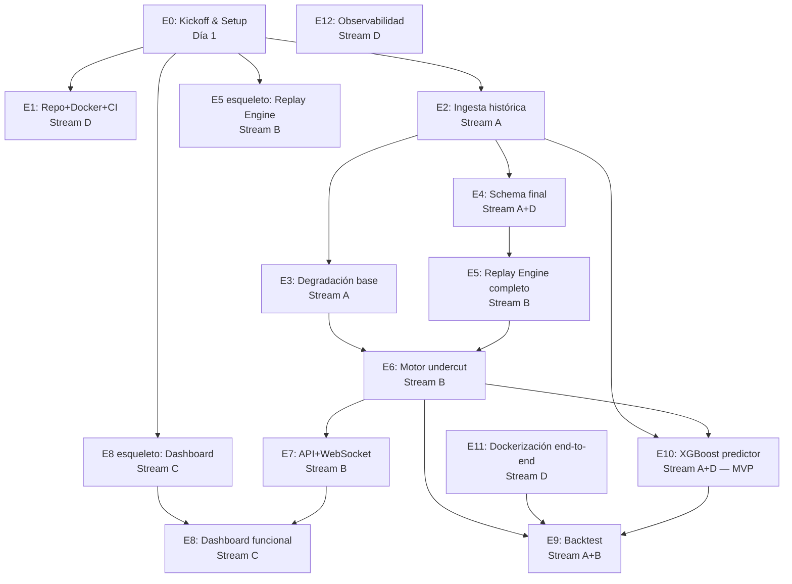

# PitWall — Plan Maestro de Ejecución

> **Tipo:** Plan técnico + andamiaje de agentes
> **Fecha plan:** 2026-05-09
> **Equipo:** 4 personas
> **Plazo MVP:** 2 semanas
> **Modo de datos primario:** Replay histórico (FastF1) que simula OpenF1
> **Despliegue:** `docker compose up` local + repo público GitHub + CI verde

---

## Contexto

PitWall es un motor que calcula en vivo, durante una carrera de F1, si conviene que un piloto entre a boxes antes que su rival inmediato (un *undercut*). La intuición es simple: parar cuesta ~21 segundos en pista; si recuperas más de 21 segundos siendo más rápido con neumático nuevo *antes* de que el rival pare, el undercut es viable. El problema real no es la fórmula — es proyectar el pace de ambos pilotos N vueltas hacia adelante con datos ruidosos, capturar la degradación no lineal del compuesto, y entregar una alerta confiable en menos de un segundo desde que llega el dato.

El producto se construye porque:
1. Es un caso de uso real de ingeniería de datos en tiempo real con ML aplicado, defendible ante un profesor de IA y demo-eable a no técnicos.
2. Los datos son 100% abiertos (FastF1, OpenF1, Jolpica), así que no hay riesgo de credenciales ni costos.
3. El cálculo del undercut es un terreno honesto donde se puede comparar **heurística vs ML** y demostrar dónde aporta cada uno — exactamente lo que un curso de IA aplicada quiere ver.
4. La señal "UNDERCUT VIABLE" es un *output* concreto, evaluable contra carreras reales (¿el equipo X realmente undercutó en la vuelta 18 del GP de Mónaco 2024? ¿nuestro sistema lo habría visto venir?).

Decisiones que enmarcan TODO el plan (ya confirmadas):
- **Equipo de 4 (clase)** → la arquitectura se descompone en 4 streams paralelos. No hay "contratos" estilo corporativo; sí hay una sesión de **kickoff Día 1** donde acordamos las interfaces que cada stream consume del otro (schema de DB, formato de eventos, endpoints, mensajes WS). Nada más pesado que eso.
- **2 semanas** → recortes agresivos: LSTM **fuera** de V1, observabilidad mínima, dashboard funcional pero no pulido. Pero **XGBoost sí está dentro del MVP** como entregable obligatorio (requisito del profesor: el sistema debe usar ML).
- **Replay-first** → no dependemos del calendario F1; en lugar de pollear OpenF1 en vivo construimos un **Replay Engine** que reproduce sesiones históricas de FastF1 emitiendo eventos al mismo formato que OpenF1. Esto es **mejor** que el plan original: reproducible, testeable, y el día que tengamos una carrera real solo cambia la fuente del feed.
- **Docker local únicamente** → sin cloud, sin Prometheus, sin Grafana en V1.
- **ML obligatorio**: XGBoost se entrena en la última etapa del sprint (E10) y se enchufa al motor como **predictor alternativo** detrás de un feature flag. La heurística scipy queda como baseline visible; XGBoost mejora sobre eso. Sin XGBoost no hay entrega.

---

# 1. RESUMEN EJECUTIVO

**Qué construimos.** Un sistema end-to-end que ingesta historia de F1 (2022–2024) con FastF1, ajusta curvas de degradación por (compuesto × circuito × equipo), reproduce una carrera vuelta a vuelta como si fuera en vivo, calcula la ventana de undercut para cada par de pilotos consecutivos en pista, y emite alertas vía WebSocket a un dashboard React donde el usuario ve tiempos, scores y curvas de degradación.

**MVP realista (2 semanas, 4 personas).**
1. Pipeline histórico: 1 temporada cargada (2024) en TimescaleDB con stints, vueltas, neumáticos, gaps.
2. Modelo de degradación heurístico (baseline): curva cuadrática por (compuesto, circuito) con scipy.
3. Replay engine: reproduce 1 carrera (Mónaco o Hungría — circuitos de 1 parada típica donde el undercut manda).
4. Motor de undercut: para cada par de pilotos consecutivos, proyecta pace y emite señal.
5. FastAPI + WebSocket: endpoints REST + 1 canal WS.
6. Dashboard React: tabla de pilotos, score de undercut como barra de color, feed de alertas.
7. **Modelo XGBoost** entrenado para predicción de pace, integrado al motor con feature flag para comparar contra el baseline scipy.
8. Backtest: validar contra 3-5 undercuts reales conocidos del 2024 + comparar baseline scipy vs XGBoost.
9. Docker-compose con todos los servicios + CI verde + ADRs + OpenAPI + README.

**Core (no se puede recortar).** Schema DB, replay engine, motor de undercut con math correcto, WebSocket, dashboard mínimo, docker-compose, CI, **modelo XGBoost integrado** (requisito del profesor).

**Diferible a V2.** LSTM, multi-temporada, cloud deploy, observabilidad pesada, manejo de lluvia, alertas de pit window propio (no del rival), análisis de tráfico/aire sucio, dashboard pulido.

---

# 2. SUPUESTOS Y DECISIONES TÉCNICAS CLAVE

## 2.1. Supuestos para V1

| # | Supuesto | Justificación |
|---|----------|---------------|
| S1 | Pace en aire limpio | Ignoramos efectos de DRS, batería, tráfico cercano. |
| S2 | Combustible no se modela explícitamente | Está implícito en la curva de degradación por vuelta absoluta del stint. |
| S3 | Pit loss es constante por (circuito, equipo) | Calculado del histórico 2022–2024 con mediana, no varía durante la carrera. |
| S4 | Carreras secas | Transiciones de seco-mojado no se modelan en V1 (alerta `SUSPENDED` en vez). |
| S5 | "Par relevante" = pilotos con gap < 30 s en posiciones consecutivas | Más allá no hay undercut útil. |
| S6 | Mínimo de 3 vueltas en stint actual antes de proyectar | Por debajo el ajuste es ruido. |
| S7 | El undercut se evalúa solo si el piloto perseguidor tiene neumáticos al menos 5 vueltas más viejos que su mínimo de stint observado | Evita alertar undercuts imposibles por reglamento. |

## 2.2. Decisiones de arquitectura

| Decisión | Por qué |
|----------|---------|
| **Replay Engine en vez de live poller en V1** | No dependemos del calendario F1, dev y test reproducibles. El poller live en OpenF1 se construye después con la misma interfaz. |
| **Heurística primero, ML después** | El motor de undercut con curva exponencial + pit loss histórico ya es publicable. ML solo si mejora medible. |
| **Polars en vez de pandas** | Pipelines de FastF1 con miles de stints; Polars es 5–10× más rápido y la API es declarativa. |
| **TimescaleDB pero sin paranoia** | El volumen real (1 temporada ≈ 30 k vueltas + lap-by-lap) cabe sin problemas en Postgres puro. Usamos Timescale por las hypertables y `time_bucket()` que simplifican queries de degradación, no por necesidad de escala. |
| **FastAPI + uvicorn + WebSockets nativos** | Stack estándar, async friendly, OpenAPI gratis, fácil de testear. |
| **React + Vite + TanStack Query** | Bundler rápido, gestión de cache simple, no necesitamos Redux para 3 vistas. |
| **Sin Kafka / sin Redis Streams** | Overkill. La cadena Replay → Motor → WebSocket cabe en `asyncio.Queue` in-process. |
| **Monorepo con workspaces simples** | Backend Python + Frontend Node coexisten, un solo `docker-compose.yml`. |
| **CI con GitHub Actions** | Lint + tests + build de imágenes. Sin deploy automático en V1. |

## 2.3. Heurística vs ML — qué hace cada uno

| Componente | V1 baseline (heurística) | V1 ML (XGBoost — entrega) | V2 (LSTM, futuro) |
|------------|--------------------------|----------------------------|-------------------|
| Degradación de neumático | `scipy.optimize.curve_fit` con modelo `lap_time(t) = a + b·t + c·t²` por (compuesto × circuito) | **XGBoost** con features: tyre_age, compound, circuit, track_temp, lap_in_stint, driver_skill_offset, team_id. Target: `lap_time_delta` vs referencia. | LSTM sobre secuencias de 8 vueltas |
| Pit loss | Mediana histórica por (circuito, equipo) | Igual (no toca XGBoost en V1) | Modelo Bayesiano |
| Detección de SC/VSC | Bandera del feed (OpenF1 `track_status`) | Igual | Igual |
| Decisión "alertar o no" | Umbral fijo sobre `gap_recuperable - pit_loss > δ` | Igual; XGBoost mejora la **proyección de pace**, no la decisión | Calibración con logística |
| Cliff de degradación | Última vuelta >2σ peor que la media → fin de vida útil | XGBoost lo captura con `lap_in_stint_ratio` y no-linealidad de árboles | LSTM |

**Cómo se integran ambos modelos**: el motor de undercut consume una interfaz `PacePredictor` con dos implementaciones (`ScipyPredictor`, `XGBoostPredictor`). Un flag `PACE_PREDICTOR=xgb|scipy` en config decide cuál usa el motor en runtime. Esto permite el A/B en el backtest y dejar al profesor jugar con ambos.

## 2.4. Riesgos por fuente de datos

**OpenF1**:
- Rate limiting no documentado oficialmente; en práctica se han visto 429s con polling agresivo.
- Algunos endpoints (intervals, pits) tienen **lag de 2-5 segundos** del live real.
- Schema cambia silenciosamente entre temporadas.
- *Mitigación*: como vamos replay-first, no nos toca esto en V1. Pero diseñamos la interfaz `RaceFeed` abstracta para que `OpenF1Feed` sea drop-in cuando queramos vivo.

**FastF1**:
- Cache puede crecer a varios GB; hay que `fastf1.Cache.enable_cache(path)` desde Día 1.
- Telemetría detallada no está disponible para sesiones recientes hasta días después.
- Datos de neumáticos en algunos años tienen huecos (sobre todo 2022).
- *Mitigación*: fijamos versión de `fastf1` en `requirements.txt` y validamos columnas críticas en el ingestor con `pandera` o asserts.

**Jolpica** (sucesor del Ergast):
- Solo da metadatos (calendario, resultados, ronda, circuito), no telemetría.
- *Mitigación*: lo usamos solo para enriquecer (¿qué carrera es esta?, ¿qué clima reportó?), nunca como fuente primaria.

---

# 3. DESGLOSE ETAPA POR ETAPA

> **Convención:** Para cada etapa indico **owner** (qué stream del equipo lo lleva). Streams: **A** = Datos Históricos, **B** = Motor + API, **C** = Frontend, **D** = Plataforma.

---

## Etapa 0 — Kickoff y alineación de interfaces
**Owner:** Todos (sesión conjunta de ~2 h) | **MVP:** sí | **Día 1**

- **Objetivo:** Que los 4 streams puedan trabajar en paralelo sin bloquearse, alineando solo lo mínimo: schema DB, formato de eventos del replay, endpoints REST/WS que el frontend va a consumir.
- **Entregables (livianos, en `docs/interfaces/`):**
  - `docs/architecture.md` con diagrama final.
  - `docs/interfaces/db_schema_v1.sql` — versión 1 del schema (A propone, todos validan).
  - `docs/interfaces/openapi_v1.yaml` — esqueleto con endpoints y modelos.
  - `docs/interfaces/websocket_messages.md` — tipos de mensajes y payload ejemplo.
  - `docs/interfaces/replay_event_format.md` — qué emite el replay, qué consume el motor.
  - `CLAUDE.md`, `AGENTS.md`, `README.md` esqueleto.
- **Criterios done:** Todos los streams pueden empezar sin esperar a otro. PR mergeado a main.
- **Riesgo:** Saltarse esta etapa "por ir rápido" → bloqueo seguro al día 4. Pero tampoco pasar el día completo aquí: 2-3 horas máximo, lo que no se decida se mockea y se ajusta sobre la marcha.

## Etapa 1 — Setup de repo, Docker y CI
**Owner:** D | **MVP:** sí

- **Objetivo:** Que cualquier persona clone el repo, corra `docker compose up`, vea backend en :8000, frontend en :5173, postgres en :5432.
- **Tareas:**
  - `pyproject.toml` con `uv` o `poetry` (recomiendo `uv` por velocidad).
  - `docker/backend.Dockerfile`, `docker/frontend.Dockerfile`.
  - `docker-compose.yaml` con servicios: `db` (timescaledb), `backend`, `frontend`, `migrate`.
  - GitHub Actions: `lint.yml` (ruff + mypy + eslint), `test.yml` (pytest + vitest), `build.yml` (build images).
  - Pre-commit hooks (ruff, prettier).
  - `Makefile` con targets: `up`, `down`, `test`, `lint`, `seed`, `migrate`, `replay`.
- **Done:** PR mergeado, badge de CI verde en README.
- **Riesgo:** Volúmenes Docker en macOS son lentos → mount selectivo.

## Etapa 2 — Ingestión histórica (FastF1 → DB)
**Owner:** A | **MVP:** sí

- **Objetivo:** Cargar 1 temporada (2024) con vueltas, stints, pit stops, neumáticos, condiciones.
- **Tareas:**
  - Activar `fastf1.Cache` en directorio persistente (`./data/cache`).
  - Script `scripts/ingest_season.py` que itera GP, sesión `R`, descarga `Laps`, `PitStops`, `SessionInfo`, `Weather`.
  - Reconstruir stints: `(driver, stint_number, compound, lap_start, lap_end, age_at_start)`.
  - Normalizar lap times a milisegundos (`int`), filtrar vueltas inválidas (`PitInLap`, `Deleted`, fuera de tiempo razonable).
  - Insertar en bulk con `polars.write_database` o `COPY` por velocidad.
- **Done:** Query `SELECT count(*) FROM laps WHERE season=2024` da ≈ 30k. `SELECT * FROM stints WHERE driver_code='VER'` muestra estructura coherente.
- **Riesgo:** Datos de 2022 tienen huecos de compuesto; trabajar con 2023-2024 si presiona el tiempo.

## Etapa 3 — Modelado de degradación base
**Owner:** A (asesoría B) | **MVP:** sí

- **Objetivo:** Una función `predict_lap_time(driver, compound, circuit, tyre_age) -> float` calibrada por circuito y compuesto.
- **Tareas:**
  - Para cada (circuito × compuesto), agrupar vueltas válidas y filtrar outliers (vueltas con SC, VSC, pit lap).
  - Ajustar `lap_time = a + b·age + c·age²` con `scipy.optimize.curve_fit`.
  - Persistir coeficientes en tabla `degradation_coefficients`.
  - Calcular R² por ajuste; tirar warning si R² < 0.6.
  - Función Python `degradation_curve(circuit, compound) -> Callable[[int], float]`.
- **Done:** Notebook que muestra ajuste vs puntos reales para Mónaco × MEDIUM con R² ≥ 0.7.
- **Riesgo:** Outliers (SC laps) sesgan el ajuste → filtrar por `track_status` antes del fit.

## Etapa 4 — Schema final de DB y migraciones
**Owner:** A + D | **MVP:** sí

- **Objetivo:** Schema DB versionado y migraciones reproducibles.
- **Tareas:**
  - Decidir herramienta: `alembic` (estándar Python) — recomendado.
  - Definir entidades (ver §5).
  - Convertir tablas time-series a hypertables: `laps`, `live_lap_events`, `live_gaps`.
  - Índices: `(session_id, driver_code, lap_number)`, `(circuit_id, compound)`.
  - Vistas materializadas: `pit_loss_per_circuit_team`.
- **Done:** `make migrate` reproduce schema desde cero. `make seed` carga 1 carrera de prueba.
- **Riesgo:** Cambios de schema tarde en el sprint → congelar al final del Día 3.

## Etapa 5 — Replay Engine (sustituye al poller live)
**Owner:** B | **MVP:** sí

- **Objetivo:** Componente que dado `(session_id, speed_factor)` reproduce una carrera vuelta a vuelta emitiendo eventos al formato definido en `replay_event_format.md`.
- **Tareas:**
  - Lectura ordenada por timestamp de `laps`, `pit_stops`, `gaps`, `track_status` desde DB.
  - Loop `asyncio` que duerme `dt / speed_factor` entre eventos (factor 60× para tests).
  - Publicación a `asyncio.Queue` interna o pub/sub local.
  - Interfaz abstracta `RaceFeed` con dos implementaciones: `ReplayFeed` (V1) y stub `OpenF1Feed` (V2).
- **Done:** Reproducir Mónaco 2024 en 60× y ver en logs los eventos en orden cronológico.
- **Riesgo:** Si dejamos el reloj del replay en wall-clock y el motor es lento, se acumula lag. Solución: usar tiempos relativos a `T0 = inicio_carrera` y procesar eventos por orden, no por tiempo real.

## Etapa 6 — Motor de undercut
**Owner:** B | **MVP:** sí | **Pieza más crítica**

- **Objetivo:** Servicio que consume eventos del feed, mantiene estado en memoria, y para cada par relevante calcula score y emite alertas.
- **Tareas:** ver §6 en detalle.
- **Done:** Replay de Mónaco 2024 con velocidad 60× emite ≥ 1 alerta `UNDERCUT_VIABLE` correcta y ≤ 2 falsos positivos en backtest manual.
- **Riesgo:** Más algorítmico que de infra; ver §6 para edge cases.

## Etapa 7 — API REST + WebSocket
**Owner:** B | **MVP:** sí

- **Objetivo:** Exponer estado y alertas.
- **Endpoints REST:**
  - `GET /api/v1/sessions` → lista de sesiones disponibles.
  - `GET /api/v1/sessions/{id}/snapshot` → estado actual (posiciones, gaps, neumáticos, last alert).
  - `GET /api/v1/degradation?circuit=monaco&compound=medium` → curva ajustada con R² y puntos.
  - `POST /api/v1/replay/start` → arranca replay con `{session_id, speed_factor}`.
  - `POST /api/v1/replay/stop`.
  - `GET /api/v1/backtest/{session_id}` → comparación de alertas vs realidad.
- **WebSocket:**
  - `WS /ws/v1/live` → mensajes: `lap_update`, `pit_stop`, `alert`, `track_status`, `replay_state`.
- **Done:** OpenAPI generado, esquema cuadra con `docs/interfaces/openapi_v1.yaml`, clientes Python y JS pueden suscribirse.
- **Riesgo:** Backpressure WebSocket si el cliente es lento → drop policy "keep latest snapshot".

## Etapa 8 — Dashboard React
**Owner:** C | **MVP:** sí

- **Objetivo:** UI funcional, no bonita.
- **Tareas:**
  - Vite + React + TypeScript + TanStack Query + Tailwind (rapidez).
  - Componente `<SessionPicker>` → llama a `/sessions`.
  - Componente `<RaceTable>` con columnas: Pos, Driver, Gap, Compound, Tyre Age, Undercut Score (barra).
  - Componente `<DegradationChart>` con Recharts: puntos reales vs curva ajustada.
  - Componente `<AlertFeed>` que escucha WS y muestra últimas 20 alertas con timestamp y ganancia estimada.
  - Cliente WS reconectable.
- **Done:** Demo: usuario elige Mónaco 2024, hace play en velocidad 30×, ve la tabla actualizándose, recibe alertas con flash visual cuando llegan.
- **Riesgo:** Sub-engineering del estado WS → centralizar en un hook `useRaceFeed`.

## Etapa 9 — Backtesting & métricas
**Owner:** A + B | **MVP:** sí (mínimo)

- **Objetivo:** Demostrar que el sistema sirve.
- **Tareas:** ver §8.
- **Done:** Notebook `notebooks/backtest_v1.ipynb` con tabla de undercuts conocidos vs predicciones, precision/recall, MAE de proyección de pace.
- **Riesgo:** "Curva-fitting confirmation bias" — si entrenas y testeas en la misma carrera, claro que funciona. Validación con leave-one-race-out.

## Etapa 10 — Modelo XGBoost de pace (entregable de ML del MVP)
**Owner:** A (lead) + D (integración/CI) | **MVP:** **SÍ** (requisito del profesor) | **Días 8–10**

- **Objetivo:** Entrenar un XGBoost que predice `lap_time_delta` y reemplaza la curva scipy detrás de una interfaz común. Demostrar mejora medible sobre el baseline.
- **Tareas:**
  - Definir interfaz `PacePredictor` con métodos `predict(driver, compound, tyre_age, k) -> ms` y `confidence() -> float`.
  - `ScipyPredictor` (ya existente) implementa la interfaz. Refactor mínimo en E6 para usarla.
  - Construir dataset desde DB: vueltas válidas en clean air, split **leave-one-race-out**.
  - Features: `tyre_age`, `compound_one_hot`, `circuit_id_one_hot`, `track_temp`, `air_temp`, `lap_in_stint`, `lap_in_stint_ratio`, `driver_skill_offset` (precomputado), `team_id_one_hot`, `fuel_proxy = 1 - laps_done/total_laps`.
  - Target: `lap_time - p20_lap_time(compound, circuit)` (delta a vuelta-referencia para normalizar entre circuitos).
  - Entrenar con `xgboost.XGBRegressor`, hiperparámetros razonables (`max_depth=5`, `n_estimators=400`, early stopping), sin tuning extenso.
  - Persistir modelo en `models/xgb_pace_v1.json` y registrar metadatos (features, fecha, métricas) en tabla `model_registry`.
  - `XGBoostPredictor` carga el modelo al boot del backend.
  - Feature flag `PACE_PREDICTOR=scipy|xgb` en config; default = `xgb` para la demo final.
  - En el backtest notebook (E9), correr ambos predictors y reportar tabla comparativa.
  - ADR `0009-xgboost-vs-scipy.md` documentando la decisión y resultados.
- **Done:**
  - XGBoost entrenado y serializado, cargable en boot del backend.
  - Backtest notebook muestra tabla: `MAE@k=3` y `precision/recall` con scipy vs XGBoost en al menos 5 carreras hold-out.
  - El switch `PACE_PREDICTOR=xgb` cambia el comportamiento del motor sin redeploy.
  - Quanta `06-curve-fit-vs-xgboost.md` escrita con números reales del experimento.
- **Riesgo:** Que se coma demasiado tiempo. Mitigación: timebox de 3 días (D8–D10), hiperparámetros fijos, sin tuning. Si XGBoost no mejora sobre scipy, lo entregamos igual, lo documentamos honestamente como "exploramos ML, el baseline scipy es competitivo en este dataset" — eso también es resultado válido para el profesor.
- **Lo que NO incluye esta etapa:** LSTM, redes neuronales, AutoML, hyperparameter tuning extenso, feature engineering exótico. Todo eso es V2.

## Etapa 11 — Dockerización & despliegue local
**Owner:** D | **MVP:** sí

- **Objetivo:** `git clone && docker compose up` y todo funciona.
- **Tareas:**
  - Multi-stage Dockerfile para backend (build deps separadas).
  - Dockerfile para frontend con `nginx` sirviendo build estático.
  - `docker-compose.yaml` con healthchecks reales (no solo `sleep 5`).
  - `.env.example` documentado.
  - `make demo` = up + seed + abrir browser.
- **Done:** En máquina limpia, time-to-demo < 10 minutos (bajar imágenes incluido).
- **Riesgo:** Ingestión inicial puede tardar. Pre-cargar dump de DB con 1 carrera para que la demo arranque rápido.

## Etapa 12 — Observabilidad & hardening (mínimo viable)
**Owner:** D | **MVP:** sí (mínimo)

- **Objetivo:** Logs estructurados, errores no se comen silenciosamente, healthchecks.
- **Tareas:**
  - `structlog` para logs JSON.
  - `/health` y `/ready` en backend.
  - Manejo global de excepciones en FastAPI con Sentry-like log.
  - WebSocket: ping/pong cada 15 s.
- **Done:** Si tiras la DB, el backend reporta `ready=false` en 5 s. Si la API revienta, el frontend muestra estado degradado, no se queda en blanco.

---

# 4. ORDEN CORRECTO DE IMPLEMENTACIÓN



## Paralelizable
- **Día 1**: E0 colaborativo. Al final del día, **interfaces compartidas acordadas y commiteadas**.
- **Días 2–4**: E1 (D), E2 (A), E5 esqueleto (B), E8 esqueleto (C) → **100% paralelo**.
- **Días 5–7**: E3 (A), E4 (A+D), E5 completo (B), E8 (C) → **paralelo con sync diario**.
- **Días 8–10**: E6 (B) y E7 (B) van seriados; A pasa a E9, C cierra E8, D inicia E11+E12.

## Cosas que NO deben construirse pronto
- **LSTM**: post-MVP. Ni siquiera carpeta dedicada en V1.
- **Multi-temporada masiva**: 2024 alcanza para MVP.
- **Live OpenF1**: stub, pero no implementación real, en V1.
- **Sistema de alertas externo (email/slack)**: distrae del core.
- **Auth / users**: nadie nos paga, no hay PII.
- **CI/CD que despliegue a cloud**: no hay cloud.
- **Métricas Prometheus/Grafana**: en V1 basta con logs.

---

# 5. DISEÑO DE DATOS

## 5.1. Entidades principales

| Entidad | Descripción | Vol. estimado V1 |
|---------|-------------|------------------|
| `circuits` | Catálogo de circuitos (Mónaco, Spa, ...) | ~24 |
| `seasons` | Temporadas (2024) | 1–3 |
| `events` | GPs (Bahrain 2024 Race, ...) | ~24 |
| `sessions` | Sesión específica (R, Q, FP1...) — V1 solo R | ~24 |
| `drivers` | Pilotos | ~25 |
| `teams` | Equipos | ~10 |
| `laps` | Vueltas con tiempo, sector, compuesto, tyre_age | ~30 k |
| `pit_stops` | Paradas históricas con duración | ~60 / carrera |
| `stints` | Tramos de una carrera con un compuesto | ~50 / carrera |
| `track_status_events` | SC, VSC, banderas | ~5–15 / carrera |
| `degradation_coefficients` | Coeficientes ajustados (a, b, c, R²) por (circuit, compound) | ~75 |
| `pit_loss_estimates` | Mediana de pit loss por (circuit, team) | ~250 |
| **Live (en memoria + persistencia ligera)** | | |
| `replay_runs` | Ejecuciones de replay (auditoría) | ~10 / día dev |
| `live_lap_events` | Eventos publicados por replay | ~30 k / carrera |
| `alerts` | Alertas emitidas por motor | ~20 / carrera |

## 5.2. Schema mínimo (extracto SQL)

```sql
CREATE EXTENSION IF NOT EXISTS timescaledb;

CREATE TABLE circuits (
  circuit_id   TEXT PRIMARY KEY,        -- 'monaco', 'spa'
  name         TEXT NOT NULL,
  pit_lane_loss_seconds REAL              -- referencia teórica del circuito
);

CREATE TABLE sessions (
  session_id   TEXT PRIMARY KEY,         -- 'monaco_2024_R'
  circuit_id   TEXT REFERENCES circuits,
  season       INT NOT NULL,
  date         DATE NOT NULL,
  session_type TEXT NOT NULL             -- 'R'
);

CREATE TABLE drivers (
  driver_code  TEXT PRIMARY KEY,         -- 'VER', 'HAM'
  full_name    TEXT,
  team_code    TEXT
);

CREATE TABLE laps (
  session_id   TEXT REFERENCES sessions,
  driver_code  TEXT REFERENCES drivers,
  lap_number   INT NOT NULL,
  lap_time_ms  INT,
  compound     TEXT,                      -- 'SOFT'/'MEDIUM'/'HARD'/'INTER'/'WET'
  tyre_age     INT,                       -- vueltas en este compuesto
  is_pit_in    BOOLEAN,
  is_pit_out   BOOLEAN,
  is_valid     BOOLEAN,                   -- excluye SC, deleted, etc.
  track_status TEXT,
  ts           TIMESTAMPTZ NOT NULL,
  PRIMARY KEY (session_id, driver_code, lap_number)
);
SELECT create_hypertable('laps', 'ts');

CREATE TABLE pit_stops (
  session_id   TEXT REFERENCES sessions,
  driver_code  TEXT,
  lap_number   INT,
  duration_ms  INT,
  pit_loss_ms  INT,                        -- delta vs vuelta media del rival
  ts           TIMESTAMPTZ,
  PRIMARY KEY (session_id, driver_code, lap_number)
);

CREATE TABLE stints (
  session_id   TEXT,
  driver_code  TEXT,
  stint_number INT,
  compound     TEXT,
  lap_start    INT,
  lap_end      INT,
  age_at_start INT,
  PRIMARY KEY (session_id, driver_code, stint_number)
);

CREATE TABLE degradation_coefficients (
  circuit_id   TEXT,
  compound     TEXT,
  a REAL, b REAL, c REAL,
  r_squared    REAL,
  n_samples    INT,
  fitted_at    TIMESTAMPTZ DEFAULT NOW(),
  PRIMARY KEY (circuit_id, compound)
);

CREATE TABLE pit_loss_estimates (
  circuit_id   TEXT,
  team_code    TEXT,
  pit_loss_ms  INT,
  n_samples    INT,
  PRIMARY KEY (circuit_id, team_code)
);

CREATE TABLE alerts (
  alert_id     UUID PRIMARY KEY DEFAULT gen_random_uuid(),
  session_id   TEXT,
  ts           TIMESTAMPTZ NOT NULL,
  attacker     TEXT, defender TEXT,
  type         TEXT,                       -- 'UNDERCUT_VIABLE', 'UNDERCUT_RISK'
  estimated_gain_ms INT,
  confidence   REAL,
  payload      JSONB
);
SELECT create_hypertable('alerts', 'ts');
```

## 5.3. TimescaleDB sí / no

| Tabla | Hypertable | Por qué |
|-------|------------|---------|
| `laps` | **Sí** | Time-series clara; queries de degradación se benefician de `time_bucket()`. |
| `alerts` | **Sí** | Auditoría temporal natural. |
| `live_lap_events` | **Sí** | Reemita histórica de replays. |
| `pit_stops` | No | Volumen pequeño, accesos por (session, driver). |
| Resto | No | Catálogos / agregados. |

## 5.4. Histórico vs snapshot en memoria

- **DB persistente:** todo lo de 5.1 — la verdad de fuente para backtest y entrenar modelos.
- **In-memory (proceso del motor):** estado de carrera actual = `dict[driver_code -> DriverState]` con posición, gap, compuesto, tyre_age, last_lap_time. Reconstruible desde el feed.
- **Materializadas:**
  - `pit_loss_per_circuit_team` (vista mat. refresheable).
  - `clean_air_lap_times` (vista mat. con vueltas válidas, sin SC/VSC/PIT/lap deleted).

## 5.5. Particionado

- Hypertables con `chunk_time_interval => INTERVAL '1 day'` — sobra para una temporada en V1.
- En V2 con multi-temporada se reconfigura a 7 días.

---

# 6. DISEÑO DEL MOTOR DE UNDERCUT

## 6.1. Pares de pilotos relevantes

Para cada vuelta `t`, el motor mantiene `RaceState`. De ahí extrae:
```
candidates = [
  (driver_i, driver_{i+1})           # pares consecutivos en posición
  para i in 1..N-1
  donde gap(i, i+1) < 30s             # filtro de cercanía
        AND ambos estén "en carrera"  # no doblados, no en boxes
        AND ninguno esté en pit window forzado (último stint)
]
```

## 6.2. Cálculo del gap actual

Del feed `lap_update` traemos el "gap to driver ahead". Si falta, calculamos como `last_lap_finish_ts(driver_{i+1}) - last_lap_finish_ts(driver_i)`. Suavizamos con media móvil de 3 vueltas para reducir ruido del cronometraje.

## 6.3. Pit loss esperado

`pit_loss_ms = pit_loss_estimates[(circuit, team_attacker)]`. Si `n_samples < 5`, fallback a mediana del circuito (todos los equipos). Si tampoco, fallback a `circuits.pit_lane_loss_seconds`.

## 6.4. Proyección de pace del piloto que se queda fuera (defender)

```
defender.lap(t+k) = degradation_curve(circuit, defender.compound)(defender.tyre_age + k)
                  + driver_baseline_offset(defender.driver_code, circuit)
                  + fuel_correction(k)             # implícito en la curva si está bien ajustada
```
- `degradation_curve` es la cuadrática ajustada en E3.
- `driver_baseline_offset` = mediana de `(lap_real - lap_curva)` sobre vueltas históricas válidas → captura "Hamilton es 0.3s más rápido que la media en este circuito".

## 6.5. Proyección de pace del piloto con neumáticos nuevos (attacker)

```
attacker.lap(t+k) = degradation_curve(circuit, new_compound)(0 + k)
                  + driver_baseline_offset(attacker.driver_code, circuit)
                  + cold_tyre_penalty(k)           # +0.8s vuelta 1, +0.3 vuelta 2, ~0 a partir de 3
```
- `new_compound` = compuesto siguiente esperado (heurística: si está en MEDIUM, probablemente irá HARD si lleva > 50% carrera, sino SOFT).
- `cold_tyre_penalty` es una constante calibrada de los datos históricos (vuelta out-lap suele ser ~0.8s más lenta que la potencial).

## 6.6. Ventana de undercut

```
gap_recuperable_acumulado(k) = sum_{j=1..k} (defender.lap(t+j) - attacker.lap(t+j))
gap_actual = gap_to_driver_ahead(attacker)         # negativo si attacker está atrás
ventana = mínimo k tal que:
   gap_recuperable_acumulado(k) >= pit_loss_ms + gap_actual + threshold
```
Donde `threshold = 0.5s` para evitar undercuts marginales.

## 6.7. Score / confianza

```
score = clamp((gap_recuperable_acumulado(k_max=5) - pit_loss_ms - gap_actual) / pit_loss_ms, 0, 1)
confidence = min(R²_defender_curve, R²_attacker_curve) * data_quality_factor
```
`data_quality_factor` baja si: faltan datos en últimas N vueltas, hay SC/VSC reciente, el stint es corto.

## 6.8. Condiciones para alerta

Emitimos `UNDERCUT_VIABLE` si:
- `score > 0.4` Y
- `confidence > 0.5` Y
- `defender` no parará en las próximas 2 vueltas según pit window (heurística: si su tyre_age > 80% del life esperado del compuesto en este circuito, asumimos que parará pronto y descartamos undercut).
- El `attacker` no ha parado ya en este stint (si ya paró, no aplica; "switch strategy" es otro tipo de alerta).

## 6.9. Edge cases

| Caso | Comportamiento |
|------|---------------|
| Safety Car activo | Suspender alertas (`status = SUSPENDED_SC`); todos los gaps colapsan. |
| VSC activo | Igual, `SUSPENDED_VSC`. |
| Lluvia (compound = INTER/WET) | V1: emitir `UNDERCUT_DISABLED_RAIN`, no calcular. |
| Tráfico | No modelado en V1; si gap del attacker al de adelante < 1.5s sostenido, marcar `confidence -= 0.2`. |
| Pilotos doblados | Excluir del cálculo (no son par relevante). |
| Stint < 3 vueltas | No proyectar (insuficiente data); emitir `INSUFFICIENT_DATA`. |
| Datos faltantes (>2 vueltas seguidas sin lap_time) | Marcar driver como `DATA_STALE`, excluir de pares hasta refresco. |
| Pit stop ya ocurrido en último ciclo | Reset de tyre_age, recalcular curva nueva, no alertar undercut sobre quien acaba de parar. |
| Outlier de lap_time (vuelta >3σ) | Filtrar de la proyección; no usar como observación. |

## 6.10. Loop de procesamiento

```
async for event in feed:
    state.apply(event)
    if event.type == "lap_complete":
        for (atk, def_) in compute_relevant_pairs(state):
            decision = evaluate_undercut(state, atk, def_)
            if decision.should_alert:
                await alerts_topic.publish(decision)
            ws_topic.publish(state.snapshot())
```

---

# 7. MVP VS VERSIÓN AVANZADA

| Componente | MVP (V1, 2 semanas) | V1.5 (post-MVP cercano) | V2 (avanzado) |
|------------|---------------------|--------------------------|---------------|
| Datos | 2024, 3 circuitos demo | 2023+2024, 10 circuitos | 2022–2024 todo |
| Degradación baseline | Cuadrática scipy por (circ, comp) | Por (circ, comp, team) | — |
| **ML predictor** | **XGBoost integrado vía `PacePredictor` flag** | XGBoost mejor afinado + features nuevas | **LSTM** sobre secuencias |
| Pit loss | Mediana hist. (circ, team) | Bayesiano con prior | Modelo dinámico |
| Replay engine | Sí, 1 carrera demo, factor configurable | Multi-carrera, scrub | Modo live OpenF1 |
| Live OpenF1 | Stub (interfaz lista) | Implementado | Producción |
| Motor undercut | Heurístico con scoring + flag predictor | + dirty air factor | + ML calibration |
| Edge cases | SC/VSC/rain/pit-just-happened | + tráfico simple | + blue flags / lapped |
| API REST | 6 endpoints core | + filtros y paginación | + GraphQL si justifica |
| WebSocket | Snapshot + alerts | + telemetry stream | + multiplexing por sesión |
| Dashboard | 3 vistas básicas + toggle scipy/xgb | + comparador de stints | + replay scrubber + heatmaps |
| Backtest | 1 notebook con 5 carreras + comparativa scipy vs XGBoost | Suite automatizada | CI con regresión de métricas |
| Auth | No | API key opcional | OAuth si público |
| Deploy | Docker local | + Fly.io single instance | + observabilidad cloud |
| Observabilidad | Logs JSON + /health | + Prometheus | + Grafana + alerting |

---

# 8. BACKTEST Y MÉTRICAS

## 8.1. Métricas offline (curvas de degradación)
- **R² del ajuste** por (circuito × compuesto). Target V1: ≥ 0.6 promedio.
- **MAE de proyección de pace** sobre `k=1..5` vueltas hacia adelante, hold-out por carrera. Target V1: ≤ 0.4 s @ k=3.
- **Estabilidad temporal**: comparar coeficientes 2023 vs 2024 — gran cambio = warning.

## 8.2. Métricas online (motor de undercut)
- **Precision @ alerta**: de los `UNDERCUT_VIABLE` emitidos en backtest, cuántos correspondieron a undercuts realmente exitosos en la realidad.
- **Recall**: de los undercuts reales conocidos en histórico, cuántos detectó nuestro sistema con anticipación ≥ 1 vuelta.
- **Lead time**: vueltas entre la primera alerta y la pit stop real correspondiente. Target: ≥ 1 vuelta.
- **False positive rate** por carrera. Target V1: ≤ 3 falsas por GP.

## 8.3. Definición de "undercut real"
Curaremos manualmente una lista de ~15-20 undercuts conocidos del 2023-2024:
- `(session_id, attacker, defender, lap_of_attempt, was_successful)`
- Successful = el attacker terminó delante después del intercambio de stops.

## 8.4. Comparación scipy vs XGBoost (entregable del MVP, E10)
- Mismo split (leave-one-race-out por `session_id`).
- Mismo target (`lap_time - p20_of(compound, circuit)`).
- Métricas: MAE@k=1..5, RMSE, MAE segmentado por compuesto y por `lap_in_stint_ratio` bucket.
- También impacto downstream: precision/recall de alertas con `PACE_PREDICTOR=scipy` vs `PACE_PREDICTOR=xgb`.
- Reportado en `notebooks/04_backtest_v1.ipynb` y resumido en quanta `06-curva-fit-vs-xgboost.md`.

## 8.5. Comparación XGBoost vs LSTM (V2, no MVP)
- **Criterio de adopción de LSTM**: mejora ≥ 15% en MAE en cliff, sin empeorar early-stint, con runtime aceptable.

## 8.6. Evaluación segmentada
- Por circuito (Mónaco vs Spa: degradación radicalmente distinta).
- Por compuesto (SOFT vs HARD).
- Por condiciones (track_temp en buckets).
- **Antipattern a evitar**: agregar todo y reportar un solo número.

---

# 9. PLAN DE ML — siendo honesto

## 9.1. ¿Tiene sentido LSTM desde el inicio? **No.**

Razones:
- 2 semanas es poco para entrenar, validar y depurar una LSTM con datos ruidosos.
- El "cliff" de degradación no es tan no-lineal como parece — XGBoost con `lap_in_stint_ratio` lo captura bien sin necesidad de secuencias.
- El bottleneck del producto **no es** la calidad de la predicción de pace; es el **score y la lógica de decisión**.
- LSTM exige más cuidado en split (data leakage temporal), regularización, y debug interpretativo. En 3 días no llegamos a un modelo defendible.

## 9.2. Estrategia de ML del MVP — **scipy → XGBoost** (ambos entregables)

El sistema entrega **dos predictores** intercambiables detrás de la interfaz `PacePredictor`:

- **`ScipyPredictor` (baseline)** — V1 desde Día 4-5
  - Modelo paramétrico `lap_time(t) = a + b·t + c·t²` por (circuito × compuesto), `scipy.optimize.curve_fit`.
  - Interpretable, rápido, ~75 ajustes en total para 3 circuitos × 5 compuestos posibles.
  - Sirve como referencia honesta contra la cual XGBoost tiene que demostrar mejora.

- **`XGBoostPredictor` (entregable de ML)** — Días 8-10
  - `xgboost.XGBRegressor` entrenado sobre todas las vueltas válidas en clean air de 2024.
  - Features:
    - `tyre_age` (vueltas en este compuesto)
    - `compound_one_hot` (SOFT/MEDIUM/HARD/INTER/WET)
    - `circuit_id_one_hot`
    - `track_temp`, `air_temp`, `humidity` (de FastF1 weather)
    - `lap_in_stint_ratio` = tyre_age / max_observed_stint(compound, circuit)
    - `stint_position` (1 = primer stint, 2 = segundo, ...)
    - `driver_skill_offset` (mediana de delta a vuelta-referencia precomputada)
    - `team_id_one_hot`
    - `fuel_proxy` = 1 - (laps_done / total_laps)
  - Target: `lap_time_ms - p20_of(compound, circuit)` — delta a vuelta-referencia para normalizar.
  - Hiperparámetros: `max_depth=5`, `n_estimators=400`, `learning_rate=0.05`, early stopping. Sin tuning extenso (timebox).
  - Modelo serializado como `models/xgb_pace_v1.json` + metadata en tabla `model_registry`.

## 9.3. Dataset, target, ventanas

- **Dataset MVP**: vueltas válidas de 2024 — clean air, no pit-in/out, no SC/VSC, lap_time razonable.
- **Target**: `delta_to_reference = lap_time - p20_of(compound, circuit)`.
- **Split**: **leave-one-race-out** sobre las 3 carreras de demo + 5 carreras hold-out adicionales para evaluación.
- Si llegáramos a LSTM (V2): secuencia de las últimas 8 vueltas, predecir vuelta `t+1, t+2, t+3`.

## 9.4. Leakage — qué cuidar

- **No mezclar** vueltas de la misma carrera entre train y test → split por `session_id`, no por random rows.
- **No usar** `position` ni `gap_to_leader` como feature — son consecuencia de la decisión que queremos predecir.
- **No usar** vueltas posteriores al pit stop para predecir el momento del pit stop.
- **No incluir** `compound_next` (qué neumático se puso después) como feature.
- **Cuidado** con `tyre_age` calculado con info post-fact: tomarlo del feed live (acumulativo), no del histórico ya parsado.
- **`p20_of(compound, circuit)`** se calcula sobre **train fold únicamente**, no sobre todo el dataset.

## 9.5. Baselines a comparar (todos en backtest del MVP)

1. **B0 — Mediana del compuesto en el circuito.** Línea muerta. Cualquier modelo debe mejorarla.
2. **B1 — `ScipyPredictor`** (nuestra V1 baseline).
3. **B2 — `XGBoostPredictor`** (nuestro entregable ML).
4. **B3 — LSTM** (V2, no MVP).

## 9.6. Métricas que reportamos para B0/B1/B2

- `MAE@k` para `k = 1..5` vueltas hacia adelante.
- `MAE` segmentado por compuesto y por `lap_in_stint_ratio` bucket (0-25%, 25-50%, 50-75%, 75-100%).
- `precision/recall` de alertas `UNDERCUT_VIABLE` cuando el motor usa cada predictor.
- Tiempo de inferencia (debe seguir cumpliendo < 50 ms por par de pilotos).

## 9.7. Resultado honesto del experimento (cualquiera es válido como entrega)

| Resultado | Cómo lo presentamos |
|-----------|---------------------|
| XGBoost mejora claramente sobre scipy | Default = `xgb`. ADR celebra el resultado. Quanta lo explica con números. |
| XGBoost mejora marginalmente (< 5%) | Default = `scipy` (más simple). ADR dice "exploramos XGBoost, mejora 3% — no justifica complejidad operativa". Es una decisión de ingeniería válida. |
| XGBoost empeora | Default = `scipy`. ADR es honesto: "el dataset 2024 con 3 circuitos no es suficiente para que XGBoost generalice; queda como base para más datos en V2". |

En los tres casos hay entregable: dos modelos, comparados con métricas, con ADR honesto. El profesor pidió ML — lo está pidiendo en el sentido de "demuestren que aplicaron y evaluaron un modelo", no en el sentido de "garanticen que el modelo gana". Eso lo cubrimos con cualquier resultado.

## 9.8. Cuándo justifica LSTM (V2)

- B2 deja MAE > 0.3s en últimos 20% de vida útil del compuesto, **y**
- Hay > 5 ejemplos por (circuito, compuesto), **y**
- Tenemos 1 semana dedicada solo a esto, **y**
- El cliff de degradación es claramente no capturable con árboles (raro).

Si no se cumplen los cuatro: LSTM se queda en V2.

---

# 10. ESTRUCTURA DEL REPO

```
f1_strategy_engine/
├── README.md
├── CLAUDE.md
├── AGENTS.md
├── docker-compose.yaml
├── Makefile
├── .env.example
├── .gitignore
├── pyproject.toml
├── .github/
│   └── workflows/
│       ├── lint.yml
│       ├── test.yml
│       └── build.yml
├── .claude/
│   ├── settings.json
│   ├── commands/                         # slash commands custom (opcional)
│   └── plans/                            # planes técnicos y diseños
├── docker/
│   ├── backend.Dockerfile
│   ├── frontend.Dockerfile
│   └── postgres-init.sql
├── docs/
│   ├── architecture.md
│   ├── walkthrough.md
│   ├── progress.md
│   ├── blog.md
│   ├── changelog.md
│   ├── adr/
│   │   ├── 0001-stack-base.md
│   │   ├── 0002-replay-first.md
│   │   ├── 0003-timescaledb.md
│   │   ├── 0004-baseline-scipy-antes-de-xgboost.md
│   │   ├── 0005-monorepo-vs-polirepo.md
│   │   ├── 0006-polars-vs-pandas.md
│   │   ├── 0007-asyncio-sin-broker.md
│   │   ├── 0008-openapi-como-fuente-verdad.md
│   │   ├── 0009-xgboost-vs-scipy-resultados.md
│   │   └── ...
│   ├── interfaces/
│   │   ├── db_schema_v1.sql
│   │   ├── openapi_v1.yaml
│   │   ├── websocket_messages.md
│   │   └── replay_event_format.md
│   ├── quanta/                           # explicaciones cortas (estilo profesor)
│   │   ├── 01-undercut.md
│   │   ├── 02-degradacion-neumatico.md
│   │   ├── 03-pit-loss.md
│   │   ├── 04-ventana-undercut.md
│   │   ├── 05-replay-engine.md
│   │   ├── 06-curva-fit-vs-xgboost.md
│   │   ├── 07-backtest-leakage.md
│   │   └── 08-arquitectura-async.md
│   └── gameplan_4people.md
├── backend/
│   ├── pyproject.toml
│   ├── src/
│   │   └── pitwall/
│   │       ├── __init__.py
│   │       ├── api/
│   │       │   ├── main.py
│   │       │   ├── routes/
│   │       │   │   ├── sessions.py
│   │       │   │   ├── degradation.py
│   │       │   │   ├── replay.py
│   │       │   │   └── backtest.py
│   │       │   └── ws.py
│   │       ├── core/
│   │       │   ├── config.py
│   │       │   ├── logging.py
│   │       │   └── topics.py             # asyncio.Queue / pub-sub interno
│   │       ├── feeds/
│   │       │   ├── base.py               # interfaz RaceFeed
│   │       │   ├── replay.py             # ReplayFeed
│   │       │   └── openf1.py             # stub
│   │       ├── engine/
│   │       │   ├── state.py              # RaceState in-memory
│   │       │   ├── undercut.py           # cálculo principal
│   │       │   ├── projection.py         # proyección de pace
│   │       │   └── pit_loss.py
│   │       ├── degradation/
│   │       │   ├── fit.py                # scipy curve_fit
│   │       │   └── store.py              # leer/escribir coeficientes
│   │       ├── ingest/
│   │       │   ├── fastf1_loader.py
│   │       │   ├── stints.py
│   │       │   └── normalize.py
│   │       ├── db/
│   │       │   ├── models.py             # SQLModel / SQLAlchemy
│   │       │   ├── session.py
│   │       │   └── migrations/           # alembic
│   │       └── ml/                       # entregable XGBoost del MVP (E10)
│   │           ├── __init__.py
│   │           ├── features.py            # construcción de features
│   │           ├── dataset.py             # split LORO + load
│   │           ├── train_xgb.py           # entrenamiento + serialización
│   │           ├── predictor.py           # XGBoostPredictor (impl PacePredictor)
│   │           └── registry.py            # metadatos del modelo
│   └── tests/
│       ├── unit/
│       ├── integration/
│       └── fixtures/
├── frontend/
│   ├── package.json
│   ├── vite.config.ts
│   ├── index.html
│   ├── src/
│   │   ├── main.tsx
│   │   ├── App.tsx
│   │   ├── api/
│   │   │   ├── client.ts
│   │   │   └── ws.ts
│   │   ├── hooks/
│   │   │   └── useRaceFeed.ts
│   │   ├── components/
│   │   │   ├── SessionPicker.tsx
│   │   │   ├── RaceTable.tsx
│   │   │   ├── DegradationChart.tsx
│   │   │   └── AlertFeed.tsx
│   │   └── styles/
│   └── tests/
├── notebooks/
│   ├── 01_explore_fastf1.ipynb
│   ├── 02_fit_degradation.ipynb
│   ├── 03_pit_loss.ipynb
│   ├── 04_backtest_v1.ipynb
│   └── 05_xgboost_train_eval.ipynb       # E10 — entrenamiento y comparación XGBoost vs scipy
├── scripts/
│   ├── ingest_season.py
│   ├── fit_degradation.py
│   ├── compute_pit_loss.py
│   ├── seed_demo.py
│   └── replay_cli.py
├── infra/                                # documentación de infra (no IaC en V1)
│   ├── README.md
│   ├── docker-compose-architecture.md
│   └── runbook.md
└── data/                                 # gitignored salvo schemas
    ├── cache/                            # FastF1 cache
    └── seed/                             # dumps mínimos para demo
```

---

# 11. PLAN DE TESTING

## 11.1. Unit
- `degradation/fit.py`: ajuste sobre dataset sintético con respuesta conocida → coeficientes recuperados con tolerancia.
- `engine/projection.py`: dado curva mock + estado mock → output esperado.
- `engine/undercut.py`: tabla de casos (gap, pit_loss, pace_attacker, pace_defender) → decisión esperada.
- `feeds/replay.py`: orden de eventos correcto, factor de velocidad respetado.
- `ingest/stints.py`: reconstrucción correcta de stints en datasets fixture.

## 11.2. Integración
- `ingest_season → DB`: arrancar Postgres en testcontainer, ingerir 1 carrera, validar conteos.
- `replay → engine → ws`: arrancar replay sobre dump fixture, capturar mensajes WS, verificar emisión de ≥ 1 alerta esperada.

## 11.3. Contract tests con APIs externas
- `fastf1_loader`: VCR.py o `pytest-recording` para cassettes de FastF1 — congelamos respuestas y detectamos si FastF1 cambia schema.
- `openf1` (V2): mismo patrón.
- `jolpica`: validación de schema mínimo en CI lento (1 vez/día), no en cada PR.

## 11.4. Replay histórico como test
- Carrera Mónaco 2024 + lista curada de undercuts conocidos = test de aceptación.
- CI corre el replay a 1000× y valida `precision >= 0.5`, `recall >= 0.5` en este dataset.

## 11.5. Tests del motor
- Edge cases enumerados en §6.9 cada uno con un test que reproduce el escenario.
- Property-based tests con `hypothesis` para invariantes:
  - "Si pit_loss > gap_recuperable_max, no se emite UNDERCUT_VIABLE."
  - "Si confidence < 0.5, no se emite alerta."

## 11.6. Tests del dashboard
- Vitest + React Testing Library para componentes.
- Playwright (1 happy path) end-to-end: cargar dashboard, seleccionar sesión, hacer play, ver tabla cambiar.

## 11.7. Validación de datos
- `pandera` o asserts en ingest: lap_time_ms en rango razonable (60_000–180_000), compound en valores válidos, tyre_age >= 0.
- Job `validate_data.py` que se puede correr contra cualquier dump.

---

# 12. PLAN DE DESPLIEGUE

## 12.1. Local con Docker Compose

`docker-compose.yaml` (resumen):
```yaml
services:
  db:
    image: timescale/timescaledb:latest-pg15
    environment:
      POSTGRES_USER: pitwall
      POSTGRES_PASSWORD: pitwall
      POSTGRES_DB: pitwall
    volumes:
      - pgdata:/var/lib/postgresql/data
      - ./docker/postgres-init.sql:/docker-entrypoint-initdb.d/init.sql
    healthcheck:
      test: ["CMD-SHELL", "pg_isready -U pitwall"]
      interval: 5s

  migrate:
    build: { context: ., dockerfile: docker/backend.Dockerfile, target: dev }
    command: alembic upgrade head
    depends_on:
      db: { condition: service_healthy }
    environment:
      DATABASE_URL: postgresql://pitwall:pitwall@db:5432/pitwall

  backend:
    build: { context: ., dockerfile: docker/backend.Dockerfile, target: dev }
    command: uvicorn pitwall.api.main:app --host 0.0.0.0 --port 8000 --reload
    ports: ["8000:8000"]
    depends_on:
      migrate: { condition: service_completed_successfully }
    environment:
      DATABASE_URL: postgresql://pitwall:pitwall@db:5432/pitwall
      LOG_LEVEL: INFO

  frontend:
    build: { context: ./frontend, dockerfile: ../docker/frontend.Dockerfile, target: dev }
    ports: ["5173:5173"]
    environment:
      VITE_API_URL: http://localhost:8000
      VITE_WS_URL: ws://localhost:8000/ws/v1/live

volumes:
  pgdata:
```

## 12.2. Servicios necesarios
- **db** (TimescaleDB)
- **migrate** (one-shot, alembic)
- **backend** (FastAPI + replay engine + motor)
- **frontend** (Vite dev server o nginx en build prod)

## 12.3. Variables de entorno
| Var | Descripción | Default V1 |
|-----|-------------|------------|
| `DATABASE_URL` | conexión Postgres | `postgresql://pitwall:pitwall@db:5432/pitwall` |
| `LOG_LEVEL` | INFO/DEBUG | `INFO` |
| `REPLAY_DEFAULT_SESSION` | session a precargar | `monaco_2024_R` |
| `REPLAY_DEFAULT_SPEED` | factor inicial | `30` |
| `FASTF1_CACHE_DIR` | cache FastF1 | `/data/cache` |
| `VITE_API_URL` | front → back | `http://localhost:8000` |

## 12.4. Estrategia mínima de deploy
- **V1**: `git clone && cp .env.example .env && make demo`. Listo.
- **V1.5 (post-MVP)**: GitHub Actions construye y publica imágenes a GHCR. README documenta cómo correr esas imágenes en cualquier host con docker.
- **V2**: Fly.io o Railway con un proceso = backend + db gestionada.

## 12.5. Observabilidad básica
- `structlog` con output JSON.
- `/health` (proceso vivo) y `/ready` (DB conectada, último seed presente).
- WS heartbeat ping/pong cada 15 s; cliente reconecta automáticamente.
- Errores no-controlados → log con `event=unhandled_exception` + traceback completo.
- Métricas básicas: `prometheus_client` exponiendo `/metrics` aunque no tengamos Prometheus, así V1.5 lo enchufa sin tocar código.

---

# 13. RIESGOS MAYORES Y MITIGACIONES

| # | Riesgo | Probabilidad | Impacto | Mitigación |
|---|--------|--------------|---------|------------|
| R1 | FastF1 cambia API o falla con cierto GP | Media | Alto | Pin de versión, cache local, datos de prueba commiteados. |
| R2 | Curva de degradación con R² bajo en circuitos de 1 parada (Mónaco, etc.) | Alta | Medio | Caer a degradación lineal en circuitos con < N vueltas válidas. |
| R3 | Replay engine se desincroniza del reloj real bajo factores altos | Media | Medio | Procesar por "evento siguiente" no por wall-clock; tests con factor 1000×. |
| R4 | WebSocket tira al cliente con muchos updates | Baja | Medio | Throttling: 1 snapshot/s + alertas inmediatas. |
| R5 | Equipo se atasca en LSTM antes del MVP | Alta sin disciplina | **Crítico** | LSTM **prohibido** hasta E10; código ML-folder vacía en V1. |
| R6 | Diferencias macOS vs Linux en Docker | Media | Bajo | CI corre en ubuntu-latest; documentar issues de mount en macOS. |
| R7 | Tiempo se va en pulir el dashboard | Media | Alto | "UI fea pero funcional"; congelar visual el día 10. |
| R8 | Drift entre histórico y carrera actual | Baja en V1 (replay) | Medio | Refit periódico de coeficientes; banner "modelo de N días" en UI. |
| R9 | Sobreingeniería del sistema de eventos | Media | Alto | Prohibido Kafka/Redis/Celery en V1; `asyncio.Queue` y punto. |
| R10 | Coordinación 4 personas | Alta | Alto | Daily de 15 min, interfaces compartidas acordadas Día 1, PRs pequeños. |

---

# 14. CRONOGRAMA PROPUESTO

> **2 semanas, 4 personas (A, B, C, D), 5 días/semana, ~4 horas efectivas/día.**

## Semana 1 — "Esqueleto que corre y baseline scipy"

| Día | Stream A (Datos+ML) | Stream B (Motor/API) | Stream C (Frontend) | Stream D (Plataforma) |
|-----|----------------------|----------------------|---------------------|------------------------|
| 1 (L) | E0 kickoff: schema DB | E0 kickoff: API/WS shapes | E0 kickoff: UI flow | E0 setup repo + Docker skeleton |
| 2 (M) | E2 ingestor FastF1 | E5 esqueleto Replay + interfaz `RaceFeed` | E8 Vite + skeleton + design tokens | E1 docker-compose corriendo, CI lint+test |
| 3 (X) | E2 cargar 2024 a DB | E5 ReplayFeed funcional con fixture | E8 SessionPicker + RaceTable mock | E4 alembic + migraciones |
| 4 (J) | E3 fit degradación scipy + interfaz `PacePredictor` | E6 motor undercut esqueleto + state | E8 client API + WS hook | E11 Dockerfile multi-stage backend |
| 5 (V) | E3 coeficientes en DB + notebook 02 | E6 cálculo undercut V1 con `ScipyPredictor` | E8 DegradationChart con datos mock | E12 logs estructurados, /health |

**Hito S1 (viernes):** *Replay de 1 carrera arranca → motor consume usando `ScipyPredictor` → primer alert llega a un cliente WS de prueba.*

## Semana 2 — "Conectar, ML real, demostrar"

| Día | Stream A (Datos+ML) | Stream B (Motor/API) | Stream C (Frontend) | Stream D (Plataforma) |
|-----|----------------------|----------------------|---------------------|------------------------|
| 6 (L) | Pit loss por (circ, team) + curaduría undercuts | E7 endpoints REST conectados | Conectar tabla y feed a WS real | Pre-commit, badges, README |
| 7 (M) | E10 dataset XGBoost: features + split LORO | E7 OpenAPI exportado y validado | AlertFeed funcional + toggle predictor en UI | Dockerfile frontend + nginx prod |
| 8 (X) | **E10 entrenar XGBoost + serializar modelo** | Edge cases (SC/VSC/rain) + `XGBoostPredictor` cargable | Pulido visual mínimo, responsive básico | Test suite verde en CI + ADRs revisados |
| 9 (J) | E9+E10 backtest comparativo scipy vs XGBoost | Confidence final + flag `PACE_PREDICTOR` | Backtest view (resultados de comparación) | `make demo` end-to-end probado |
| 10 (V) | Quanta de XGBoost + ADR 0009 + dataset demo congelado | Dry-run completo Mónaco con ambos predictores | Demo polish, copies, branding mínimo | Cierre ADRs + walkthrough + changelog + video demo |

**Hito S2 (viernes):** *Demo end-to-end en máquina limpia en < 10 minutos. CI verde. Backtest muestra tabla comparativa scipy vs XGBoost con métricas reales. Documentación cerrada.*

## Hitos intermedios
- **Día 3:** Datos de 2024 en DB; tabla mock en frontend; replay con eventos sintéticos.
- **Día 5:** Alert pipeline end-to-end con `ScipyPredictor` funcionando.
- **Día 7:** Demo interna navegable; pipeline ML armándose; tabla en vivo conectada.
- **Día 8:** XGBoost entrenado y serializado; cargable en boot del backend.
- **Día 9:** Backtest comparativo listo con tabla de métricas scipy vs XGBoost.
- **Día 10 (entrega):** demo final, video de 3 min, README pulido, ADRs cerrados, ambos predictores funcionando en runtime.

---

# 15. RECOMENDACIÓN FINAL

## 15.1. Arquitectura recomendada para empezar
- **Replay-first.** Olvidar live OpenF1 en V1. Construir todo asumiendo que el feed es replay; la interfaz `RaceFeed` deja la puerta abierta para vivo en V2 sin tocar el motor.
- **Baseline scipy → ML XGBoost.** Construimos primero el baseline paramétrico que se entiende en una pizarra; el XGBoost se entrena al final y entra detrás de la misma interfaz `PacePredictor` con un flag. Esto **es el entregable de ML del MVP**.
- **Asyncio in-process.** Nada de message brokers. `Queue` + tasks.
- **Postgres + Timescale.** Sin Redis, sin caché extra. Las queries se sirven solas.
- **Docker compose minimalista.** 4 servicios, healthchecks reales, `make demo` reproducible.
- **Documentación es entregable.** ADRs, quanta, OpenAPI, walkthrough — equivalentes en peso a código.

## 15.2. Qué recortaría para llegar a demo rápido
- **LSTM**: fuera por completo. XGBoost sí va.
- **Multi-temporada**: 2024 y stop.
- **Multi-circuito**: 3 circuitos demo (Mónaco, Hungría, Bahrein) — los demás se ingieren si sobra tiempo.
- **Dashboard pulido**: Tailwind + tabla + 1 chart + alertas + toggle predictor. Sin animaciones complejas, sin dark mode toggle, sin i18n.
- **Live OpenF1**: stub.
- **Cloud deploy**: cero.
- **Métricas Prometheus reales**: `/metrics` endpoint vacío con la pinta correcta y ya.
- **Hyperparameter tuning de XGBoost**: hiperparámetros fijos razonables, sin Optuna ni grid search.

## 15.3. Si tuviera solo 2 semanas (= este caso)
1. Replay-first + baseline scipy + dashboard mínimo + backtest curado.
2. **XGBoost como última etapa real (D8–D10), no como stretch.** Es el entregable de ML que el profesor exige.
3. Documentación pesada (ADR + quanta) en paralelo a la implementación, no al final.
4. **No tocar LSTM.**

## 15.4. Si tuviera 6 semanas
1. Semanas 1–2: igual que el plan actual (baseline scipy + XGBoost).
2. Semana 3: live OpenF1 implementado, multi-temporada, pit loss bayesiano, XGBoost reentrenado con más datos.
3. Semana 4: tuning de XGBoost (Optuna), feature engineering (gap dynamics, interacciones), calibración de la decisión `alertar/no` con regresión logística.
4. Semana 5: dashboard pulido, replay scrubber, comparador de stints, backtest con CI de regresión.
5. Semana 6: si y solo si las métricas justifican, primera iteración de LSTM. Si no, deploy a Fly.io + Prometheus + Grafana mínimo + video de demo final.

---

# Primeras 15 tareas concretas para arrancar mañana

> **Tareas pequeñas, accionables, ordenadas. Pensadas para los Días 1–2.** Si alguna se atrasa más allá de eso, rebalancear y hablar.

1. **[D]** Crear branch `bootstrap` y agregar `.gitignore` Python+Node+Docker estándar.
2. **[D]** Crear `pyproject.toml` con `uv` para backend; `frontend/package.json` con Vite+React+TS.
3. **[D]** Crear `docker-compose.yaml` con servicios `db` (timescaledb), `backend` (uvicorn placeholder en :8000), `frontend` (vite en :5173). `docker compose up` debe levantar los 3 sin errores.
4. **[D]** Crear `.github/workflows/lint.yml` que corre `ruff check` y `eslint`. PR con esto y badge en README.
5. **[Todos]** Kickoff de ~2 h: llenar `docs/interfaces/db_schema_v1.sql`, `docs/interfaces/openapi_v1.yaml`, `docs/interfaces/websocket_messages.md`, `docs/interfaces/replay_event_format.md`, y la firma de la interfaz `PacePredictor` (acordada por A y B). Mergear a `main`.
6. **[Todos]** Crear `CLAUDE.md`, `AGENTS.md`, `README.md` esqueletos (contenido en §16).
7. **[D]** Crear `docs/adr/0001-stack-base.md`, `0002-replay-first.md`, `0003-timescaledb.md`, `0004-baseline-scipy-antes-de-xgboost.md` con plantilla MADR.
8. **[A]** Script `scripts/ingest_season.py` con argumento `--year 2024 --rounds 6,11,17` (Mónaco/Hungría/Bahrein — confirmar números reales en FastF1). Cargar a Postgres local.
9. **[A]** Notebook `notebooks/01_explore_fastf1.ipynb` que muestra estructura de `Laps` y reconstruye un stint a mano para Mónaco/VER 2024.
10. **[B]** Definir interfaz `RaceFeed` (abstract) y crear `ReplayFeed` que lee desde DB y emite eventos a un `asyncio.Queue`. Test unitario con factor 1000× sobre fixture.
11. **[B]** Endpoint placeholder `GET /api/v1/sessions` que devuelve sesiones desde DB. OpenAPI generado y commiteado.
12. **[C]** App Vite vacía con TanStack Query configurado. Llama a `/api/v1/sessions` y pinta la lista. Hook `useRaceFeed` esqueleto.
13. **[C]** Componente `<RaceTable>` con datos mock estáticos (no WS aún). Layout responsive básico.
14. **[A]** Script `scripts/fit_degradation.py` que ajusta cuadrática con `scipy.optimize.curve_fit` para Mónaco × MEDIUM y persiste en `degradation_coefficients`. Reportar R². Esta es la base sobre la que XGBoost (E10) tendrá que demostrar mejora.
15. **[D]** `make demo` que ejecuta: `docker compose up -d && python scripts/seed_demo.py && open http://localhost:5173`. Documentar en README.

> **Estas 15 deberían estar listas al final del Día 2.** Tareas de XGBoost (E10) están en backlog para Día 7 en adelante; no se empiezan ahora porque dependen de tener datos cargados (Tarea 8) y el motor con interfaz `PacePredictor` lista (Tareas 10 + 14).

---

# 16. ANDAMIAJE DE AGENTES Y DOCUMENTACIÓN

> Esta sección es la **plantilla** del contenido a crear en la fase de implementación (no se puede crear ahora porque estamos en plan mode). Cada archivo aquí lleva un esqueleto ejecutable.

## 16.1. `CLAUDE.md` (raíz del proyecto)

Propósito: contexto que carga Claude Code automáticamente. Define cómo el modelo debe trabajar en este repo.

Secciones esperadas:
1. **Project Overview**: una línea + link a `docs/architecture.md`.
2. **Stack**: Python 3.12, FastAPI, Polars, Postgres+Timescale, React+Vite+TS.
3. **Repo Layout**: árbol resumido (ver §10).
4. **Common Commands**: `make up`, `make seed`, `make replay`, `make test`, `make lint`.
5. **Key Architecture Concepts**: Replay-first, RaceFeed interface, motor in-memory.
6. **Coding Conventions**: ruff config, type hints obligatorios, docstrings cuando hay matemática.
7. **Testing**: pytest + vitest; replay-as-test.
8. **What NOT to do**: no introducir Kafka/Redis, no implementar LSTM en V1, no commitear `data/cache/`.
9. **Where to find**: contracts, ADRs, quanta.

## 16.2. `AGENTS.md` (raíz del proyecto)

Propósito: guía operativa para agentes (Claude Code, Codex, Cursor) — más compacto que CLAUDE.md, enfocado en cómo se entrega una tarea.

Secciones:
1. **Roles**: 4 streams (A/B/C/D) con responsabilidad y archivos owned.
2. **Cómo arrancar una tarea**: pull main → branch `feat/<stream>-<short>` → PR contra main.
3. **Definition of Done por tipo de tarea** (feature, bugfix, doc).
4. **Interfaces críticas que no se cambian sin acuerdo**: `RaceFeed`, schema DB, OpenAPI, WS messages.
5. **Convenciones de commits**: Conventional Commits (`feat(engine): ...`).
6. **Cómo correr tests localmente**.
7. **Qué hacer cuando el dato real contradice una asunción**: actualizar `docs/quanta/` + ADR si es decisión.

## 16.3. `.claude/` directory

```
.claude/
├── settings.json                 # ya existe, mantener
├── commands/
│   ├── replay.md                 # /replay — instrucciones para correr una replay
│   ├── ingest.md                 # /ingest — cómo cargar otra carrera
│   └── fit.md                    # /fit — refit de degradación
└── plans/
    ├── 00-master-plan.md         # link a este archivo
    ├── stream-a-data.md          # tareas detalladas Stream A
    ├── stream-b-engine.md        # tareas detalladas Stream B
    ├── stream-c-frontend.md      # tareas detalladas Stream C
    └── stream-d-platform.md      # tareas detalladas Stream D
```

## 16.4. `docs/architecture.md`

Diagrama de bloques + descripción textual:
```
[FastF1 cache] → [Ingest scripts] → [TimescaleDB]
                                      │
                  ┌───────────────────┴────────────────┐
                  ▼                                    ▼
          [Replay Engine]                    [Degradation fit]
                  │
                  ▼
            [asyncio.Queue]
                  │
                  ▼
            [Undercut Engine]
                  │
        ┌─────────┴─────────┐
        ▼                   ▼
  [REST FastAPI]      [WebSocket]
        │                   │
        └─────────┬─────────┘
                  ▼
          [React Dashboard]
```

Más:
- Tabla de componentes con responsabilidad y owner.
- Decisiones clave con link a ADRs.
- Diagrama de secuencia "alerta de undercut" desde lap_complete hasta render.

## 16.5. `docs/walkthrough.md`

Tutorial paso a paso para alguien que clona el repo:
1. Pre-requisitos (Docker, Make, ~10 GB libres).
2. `git clone ...`.
3. `cp .env.example .env`.
4. `make demo` y qué esperar.
5. Cómo correr otra carrera: `make ingest YEAR=2024 ROUND=11`.
6. Cómo correr tests: `make test`.
7. Cómo entender una alerta (con screenshot del dashboard).
8. Cómo extender (agregar circuito, agregar feed, agregar métrica).

## 16.6. `docs/progress.md`

Vivo, se actualiza en cada PR. Formato:
```
# Progress

## Semana 1
- [x] Día 1: kickoff e interfaces acordadas (#1)
- [x] Día 2: docker-compose funcional (#3, #4)
- [ ] Día 3: ingesta 2024 en DB (#7)
...
```

## 16.7. `docs/blog.md`

Bitácora honesta del equipo, en orden cronológico inverso. Posts cortos (~150 palabras) con aprendizajes. Ejemplos:
- "Por qué tiramos la idea de pollear OpenF1 en vivo (Día 2)"
- "El R² de Mónaco × MEDIUM nos sorprendió (Día 5)"

## 16.8. `docs/changelog.md`

Formato Keep a Changelog. Versionado semántico desde `0.1.0`.
```
## [0.1.0] - 2026-05-23
### Added
- Replay engine para sesiones FastF1.
- Motor de undercut heurístico.
- Dashboard React con tabla y feed de alertas.
- Backtest notebook V1.
```

## 16.9. `docs/adr/`

Plantilla MADR (Markdown Architecture Decision Record). ADRs propuestos para V1:
- 0001 — Stack base (Python+FastAPI, React+Vite, Timescale).
- 0002 — Replay-first en lugar de live polling.
- 0003 — TimescaleDB sí, Redis no.
- 0004 — Heurística antes que ML.
- 0005 — Monorepo + docker-compose.
- 0006 — Polars en lugar de pandas.
- 0007 — Asyncio in-process en lugar de message broker.
- 0008 — OpenAPI auto-generado como fuente de verdad del API.
- 0009 — XGBoost vs scipy: resultados del experimento de E10 (qué modelo queda como default y por qué).

## 16.10. `docs/quanta/`

Explicaciones cortas (1–2 páginas) que el profesor pueda leer aisladas. Cada quanta:
- Concepto.
- Por qué importa para el producto.
- Cómo se implementa en el repo (link al código).
- Ejemplo numérico.
- Riesgos / variantes.

Quanta propuestas:
1. Undercut — definición y por qué existe.
2. Degradación de neumático — modelos paramétricos.
3. Pit loss — qué es y por qué varía.
4. Ventana de undercut — la fórmula.
5. Replay engine — por qué replay antes que live.
6. Curve fit vs LSTM — cuándo justifica cada uno.
7. Backtest sin leakage — leave-one-race-out.
8. Arquitectura async — `asyncio.Queue` como bus.

## 16.11. `docs/gameplan_4people.md`

Documento operativo del equipo. Contenido:
1. Roles y owners por stream (con nombres de los 4 reales).
2. Tabla de "quién toca qué archivo" (evita merge conflicts).
3. Calendar diario: daily 15 min, demo Día 5 y 10.
4. Política de PRs: ≤ 400 líneas, ≥ 1 reviewer del stream relacionado.
5. Política de merge: squash, conventional commits.
6. Plan de contingencia: si un stream se atrasa, ¿qué se recorta?
7. Lista de archivos compartidos: si tocas `docs/interfaces/*`, schema DB, OpenAPI o la interfaz `PacePredictor`, avisas en el daily o en el canal del equipo. No es prohibido tocarlos — pero no lo hagas en silencio.
8. Cómo se entrega XGBoost: cualquiera del equipo debe poder correr `make train-xgb` y ver el modelo regenerarse.

## 16.12. `README.md` (raíz, expandir el actual)

Secciones:
1. Banner + 1-line tagline.
2. Demo (gif/video o screenshot).
3. Quickstart (3 comandos).
4. Cómo correr una replay distinta.
5. Arquitectura (link a `docs/architecture.md`).
6. Estado actual (con link a `docs/progress.md`).
7. Stack y versiones.
8. Equipo (4 nombres + roles).
9. Cómo contribuir (link a `AGENTS.md`).
10. Licencia (MIT).
11. Referencias (FastF1, OpenF1, Jolpica).

---

# 17. GAMEPLAN PARALELO PARA 4 PERSONAS

## Asignación de streams

| Stream | Persona (placeholder) | Responsabilidad principal | Skill ideal |
|--------|------------------------|---------------------------|-------------|
| **A — Datos Históricos** | P1 | Ingesta FastF1, schema DB, degradación, backtest | Python+SQL, ETL, scipy/pandas |
| **B — Motor + API** | P2 | Replay engine, motor undercut, FastAPI, WebSocket | Python async, FastAPI, lógica algorítmica |
| **C — Frontend** | P3 | Dashboard React, charts, hook WS | React+TS, UX básico |
| **D — Plataforma** | P4 | Docker, CI, tests, docs, ADRs, observabilidad | DevOps, testing, redacción técnica |

## Interfaces compartidas (acordadas en kickoff Día 1)

No son "contratos formales" — son los puntos donde un stream consume el output de otro y por eso conviene alinearlos antes de empezar. Cualquiera de estos puede cambiar sobre la marcha si se avisa al equipo.

1. **DB schema** → A propone, B/C lo usan vía SQLModel y endpoints.
2. **OpenAPI** → B propone, C consume.
3. **WebSocket message format** → B propone, C consume.
4. **Replay event format** → B propone, A produce dump compatible, D valida en CI.
5. **`PacePredictor` interface** → A y B la diseñan juntos (E10 depende de esto).
6. **Conventional Commits** → todos.
7. **Branch strategy** → trunk-based con feature branches cortas.

## Trabajo paralelo, días 2–4 (sin bloqueos)
- **A**: ingesta FastF1 + carga en DB local (no bloquea a nadie).
- **B**: ReplayFeed con fixture sintético (no necesita DB real al inicio).
- **C**: UI con datos mock estáticos en archivos JSON locales.
- **D**: docker-compose + CI + Dockerfiles + Makefile.

## Sync points
- Día 2 PM: smoke test conjunto: `docker compose up` levanta todo.
- Día 4 PM: integración A+B: el ReplayFeed lee desde DB real.
- Día 6 PM: integración B+C: el dashboard recibe alertas reales.
- Día 8 PM: integración total + backtest.
- Día 10 AM: dry-run completo de la demo final.

## Política de PRs
- ≤ 400 líneas (excepciones: schema/migraciones iniciales y modelos serializados).
- 1 reviewer mínimo, idealmente del stream que consume tu output.
- CI verde es bloqueante.
- Squash merge.

## Comunicación
- Daily 15 min: ¿qué hice ayer, qué haré hoy, qué me bloquea?
- Canal Slack/Discord con threads por stream.
- Demo interna día 5 y día 10.

## Plan de contingencia
- Si **A** se atrasa con la ingesta: B usa fixture sintético; cargamos solo Mónaco y nada más.
- Si **A** se atrasa con XGBoost: lo entregamos con métricas parciales o solo sobre 1 circuito. Lo importante es que esté integrado vía `PacePredictor` y que el ADR documente honestamente los resultados.
- Si **B** se atrasa con el motor: C trabaja sobre alertas mock; entregamos motor "al 70%" pero con backtest visible.
- Si **C** se atrasa con el dashboard: UI minimalista con tabla HTML y curl scripts; demo híbrida terminal + UI.
- Si **D** se atrasa con Docker: instrucciones manuales en README; CI con un solo workflow.
- **Lo único innegociable**: que el sistema tenga un componente de ML real (XGBoost) integrado y comparado con el baseline. Esto es requisito del profesor; sin esto, no hay entrega aceptable.

---

# 18. CUMPLIMIENTO DE REQUISITOS DEL PROFESOR

| Requisito | Cómo lo cubre el plan |
|-----------|------------------------|
| **GitHub público** | Repo con release tag `v0.1.0`, README con badges, issues template. |
| **CI/CD automatizado** | GitHub Actions: lint, test, build de imágenes en cada PR. Aunque no haya deploy, el "CD" valida que la imagen Docker se construye reproducibly. |
| **Componente de ML real** | **XGBoost entrenado en E10**, integrado al motor vía interfaz `PacePredictor`, comparado contra baseline scipy en backtest, con resultados documentados en quanta `06-curva-fit-vs-xgboost.md` y ADR `0009-xgboost-vs-scipy-resultados.md`. |
| **Documentos MD con quanta explicados** | `docs/quanta/` con 8 archivos, cada uno autocontenido. |
| **ADRs de las decisiones** | `docs/adr/` con plantilla MADR, ≥ 9 ADRs (incluye decisión sobre XGBoost vs scipy). |
| **OpenAPI** | Generado por FastAPI, exportado a `docs/interfaces/openapi_v1.yaml`, validado en CI con `openapi-spec-validator`. |
| **Infra documentada** | `infra/README.md` + `infra/docker-compose-architecture.md` + `infra/runbook.md` (cómo diagnosticar fallos comunes). |
| **README general** | Expandido con quickstart, demo, arquitectura, equipo, referencias, link al ADR de XGBoost. |
| **Corre con docker-compose** | `make demo` end-to-end probado en máquina limpia el Día 10. |

Stretch (si sobra tiempo):
- Coverage badge.
- Diagrama de arquitectura como SVG en README.
- Video de demo de 3 minutos enlazado en README.

---

# Verificación / Aceptación

El plan se considera ejecutable cuando:
1. Las 4 interfaces compartidas del Día 1 (schema DB, OpenAPI, WS messages, replay format) + la firma de `PacePredictor` están commiteadas y revisadas por los 4 owners.
2. Los 4 streams pueden iniciar sin esperar a otro stream para escribir su primera línea de código.
3. `make demo` está documentado aunque aún no funcione (es un norte).
4. Las "Primeras 15 tareas" están en el issue tracker con asignación.

El **MVP** se considera completo cuando:
1. `docker compose up` levanta backend, frontend, db en máquina limpia en < 5 min.
2. `make demo` reproduce Mónaco 2024 con replay y muestra al menos 1 alerta `UNDERCUT_VIABLE` correcta y ≤ 2 falsos positivos.
3. El backtest notebook ejecuta y produce métricas (precision, recall, MAE).
4. CI verde en `main`.
5. README, ADRs (≥ 5), quanta (≥ 5), OpenAPI commiteados.
6. Video o GIF de demo en README.

---

# Notas honestas finales (no marketing)

- El cuello de botella real **no será la ingeniería del backend** sino **la calidad de la curva de degradación** y **la curaduría de undercuts conocidos** para backtest. Subestimar esto = demo bonita sin sustancia.
- 2 semanas con 4 personas son ~40 person-days. Es justo. Alcanza para baseline scipy + XGBoost integrado, pero **no** para LSTM. Quien insista en LSTM, está pidiendo regalar el sprint.
- El diseño original mencionaba "poller asyncio de 5 endpoints OpenF1" como pieza central. **Lo replanteo**: en V1 ese rol lo cumple el Replay Engine. Razón: independencia del calendario, reproducibilidad, testing más limpio. La interfaz `RaceFeed` deja la puerta abierta para que en V2 entre `OpenF1Feed` sin tocar el motor.
- La obsesión con TimescaleDB en V1 no es por escala — el volumen es trivial — sino por *higiene de queries* (`time_bucket`, retention policies, vistas continuas). Es justificable.
- XGBoost se entrega **sí o sí** porque el profesor pidió ML, pero el orden importa: primero el motor con scipy funcionando end-to-end (Día 5), después XGBoost (Días 8-10) detrás de la misma interfaz. Si arrancamos por XGBoost antes de tener el motor, vamos a debuggear ML con un sistema que ni siquiera sabemos si funciona — eso es lo que los buenos equipos no hacen.
- Si en mitad del sprint detectamos que el motor heurístico tiene precision < 0.3 con `ScipyPredictor`, es señal de que **los datos** están mal (track_status, vueltas inválidas) y NO de que necesitamos ML. Nunca corremos a ML para tapar ruido en los datos. Un XGBoost entrenado sobre datos ruidosos hace exactamente lo mismo que la heurística: nada útil.
- Resultado honesto: si XGBoost no mejora claramente al baseline scipy, es información valiosa, no fracaso. Lo documentamos en el ADR 0009 y en la quanta correspondiente. Eso es ML aplicado real, no demo de cargo cult.
