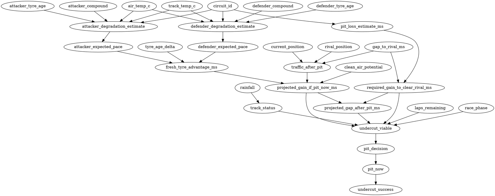

# Causal Undercut Viability Model

> Status: Phase 1-10 complete for the independent `causal_scipy` MVP. This
> document freezes the repo/data audit, variable inventory, leakage rules,
> causal dataset, labels, DAG, DoWhy/refuter prototype, live inference,
> counterfactual simulation, and explanation behavior.

## Decision

The causal module is an independent, explainable decision path for:

```text
undercut_viable = yes/no
```

It is designed to compare against the existing XGBoost path, not to wrap it.
XGBoost is not required to build the causal graph, does not define causal edges,
and is not a dependency of the first causal MVP.

No XGBoost files, model artifacts, feature importances, or predictions are used
by the causal dataset or labels. The causal path is intentionally implemented
under `pitwall.causal` so it can be compared against XGBoost without affecting
the existing ML pipeline.

The first implementation target is:

```text
causal_scipy
```

using transparent inputs: degradation coefficients, `ScipyPredictor`,
pit-loss estimates, reconstructed gaps, tyre deltas, race phase, weather, and
traffic proxies.

## Phase 1 Repo/Data Audit

### Files And Modules Reviewed

- Project/process docs: `CLAUDE.md`, `AGENTS.md`, `README.md`,
  `docs/progress.md`, `docs/architecture.md`, `docs/walkthrough.md`.
- Plans: `.claude/plans/00-master-plan.md`,
  `.claude/plans/stream-a-data.md`, `.claude/plans/stream-b-engine.md`,
  `.claude/plans/stream-b-causal-undercut.md`.
- Interfaces: `docs/interfaces/db_schema_v1.sql`,
  `docs/interfaces/replay_event_format.md`,
  `docs/interfaces/websocket_messages.md`,
  `docs/interfaces/openapi_v1.yaml`.
- Engine/runtime: `backend/src/pitwall/engine/state.py`,
  `backend/src/pitwall/engine/undercut.py`,
  `backend/src/pitwall/engine/projection.py`,
  `backend/src/pitwall/engine/loop.py`,
  `backend/src/pitwall/engine/pit_loss.py`.
- Data/ML: `backend/src/pitwall/ingest/`, `backend/src/pitwall/degradation/`,
  `backend/src/pitwall/pit_loss/`, `backend/src/pitwall/pace_offsets/`,
  `backend/src/pitwall/ml/`.
- Repositories/scripts: `backend/src/pitwall/repositories/sql.py`,
  `scripts/ingest_season.py`, `scripts/fit_degradation.py`,
  `scripts/fit_pit_loss.py`, `scripts/fit_driver_offsets.py`,
  `scripts/build_xgb_dataset.py`, `scripts/train_xgb.py`.
- Reports: `notebooks/02_fit_degradation.md`,
  `notebooks/03_pit_loss_estimation.md`, `notebooks/04_driver_team_offsets.md`,
  `notebooks/05_xgb_dataset.md`, `notebooks/06_xgb_training.md`.

### Data Sources In The Current Repo

| Source | Current use | Live/historical | Notes |
|--------|-------------|-----------------|-------|
| FastF1 cache | Historical lap, weather, timing app data | Historical/replay | V1 source of truth. Cache exists locally for Bahrain, Monaco, Hungary 2024. |
| Timescale/Postgres | Normalized runtime and model tables | Historical and replay-live | Docker DB was not available in this environment, so DB contents must be audited by script. |
| ReplayFeed | Emits DB rows as live-like events | Replay-live | V1 live path. |
| OpenF1Feed | Stub only | Future live | Not usable in V1. |
| Local model files | XGBoost artifacts when trained | Historical/runtime | `models/` currently only has `.gitkeep` in this workspace. |

### Initial Running-DB Audit Result

The audit was run against the existing project DB volume through a temporary
Timescale container on `localhost:55432`, because host port `5432` was occupied
by another local Postgres that rejected the repo credentials.

Result:

| Artifact | Rows |
|----------|------|
| sessions | 3 |
| laps | 3,721 |
| stints | 166 |
| pit_stops | 214 |
| weather | 512 |
| degradation_coefficients | 0 |
| pit_loss_estimates | 0 |
| driver_skill_offsets | 0 |
| known_undercuts | 0 |

Gap coverage:

| Session | Lap rows | `gap_to_leader_ms` rows | `gap_to_ahead_ms` rows |
|---------|----------|-------------------------|-----------------------|
| `bahrain_2024_R` | 1,129 | 0 | 0 |
| `hungary_2024_R` | 1,355 | 0 | 0 |
| `monaco_2024_R` | 1,237 | 0 | 0 |

Weather coverage is complete for available weather rows, and track status is
mostly populated (`GREEN` for 3,604 lap rows, `NULL` for 117 rows).

### Critical Gap Finding

The schema and engine support:

```text
gap_to_leader_ms
gap_to_ahead_ms
```

but the current FastF1 ingestion path does not derive these fields from the
available FastF1 lap columns. Local FastF1 cache inspection shows lap columns
such as `Time`, `LapTime`, sectors, `Compound`, `TyreLife`, `Stint`,
`TrackStatus`, and `Position`, but not direct gap columns.

The running DB audit confirms zero populated gap rows. This means Phase 3 cannot
honestly create `undercut_viable` labels until one of these is true:

1. DB audit confirms `gap_to_ahead_ms` is already populated by some existing
   local data path, or
2. gap reconstruction is implemented from FastF1 lap-end timing data, or
3. another trusted gap source is loaded.

The repeatable audit command is:

```bash
make audit-causal-inputs
```

It reads whichever database `DATABASE_URL` points to; start the compose DB first
only when local port `5432` is free, or pass an alternate `DATABASE_URL`.

This initial report said `GAP_RECONSTRUCTION_REQUIRED`, so gap reconstruction
was a hard prerequisite for Phase 3. The same DB volume also needed
`fit_degradation.py --all-demo`, `fit_pit_loss.py`, and
`fit_driver_offsets.py` before the causal dataset could use pace, pit-loss, and
driver-offset inputs.

### Pre-Phase 3 DB Prep Result

Stream B added a repeatable reconstruction command:

```bash
make reconstruct-race-gaps
```

It updates the existing `laps.gap_to_leader_ms` and `laps.gap_to_ahead_ms`
columns from FastF1 lap-end timestamps (`laps.ts`, derived from FastF1 `Time`).
No schema change is required.
Downstream causal rows must still carry
`gap_source = "reconstructed_fastf1_time"` because these are not directly
observed FastF1 interval gaps.

The command was run against the existing project DB volume through the temporary
Timescale container on `localhost:55432`.

Reconstruction coverage:

| Session | Lap rows | `gap_to_leader_ms` rows | `gap_to_ahead_ms` rows |
|---------|----------|-------------------------|-----------------------|
| `bahrain_2024_R` | 1,129 | 1,129 | 1,072 |
| `hungary_2024_R` | 1,355 | 1,355 | 1,285 |
| `monaco_2024_R` | 1,237 | 1,233 | 1,155 |

The method uses the lap end timestamp rather than cumulative `lap_time_ms`, so
missing `LapTime` rows no longer poison later gaps. Rows without race position
remain `NULL` because the adjacent rival cannot be identified honestly.

The required model artifacts were then fitted on the same DB volume:

| Artifact | Rows after prep | Notes |
|----------|-----------------|-------|
| `degradation_coefficients` | 8 | All groups fit with warnings; low R² remains documented. |
| `pit_loss_estimates` | 28 | Functional median estimates; quality remains weak/noisy on demo data. |
| `driver_skill_offsets` | 103 | Existing validation reports all persisted offsets as `ok`. |
| `known_undercuts` | 35 | Auto-derived from observed pit-cycle exchanges; human curation can still refine later. |

Final causal audit decision:

```text
gap_to_ahead_ms coverage = 94.4%
gap_to_leader_ms coverage = 99.9%
```

Therefore Phase 3 is no longer blocked by gap coverage, missing model artifacts,
or an empty observed pit-cycle table. It must still carry
`gap_source = "reconstructed_fastf1_time"` because the gaps are derived from
FastF1 timing rather than direct interval telemetry. `undercut_viable_label`
remains a proxy-modeled viability label by design, while `known_undercuts`
provides an auto-derived observed pit-cycle outcome set for initial
success/backtest evaluation.

## Phase 3-4 Dataset And Labels

The Phase 3/4 builder is independent from `pitwall.ml` and writes regenerable
artifacts under:

```text
data/causal/undercut_driver_rival_lap.parquet
data/causal/undercut_driver_rival_lap.meta.json
```

Repeatable command:

```bash
make build-causal-dataset
```

Latest local DB-volume result:

| Metric | Value |
|--------|-------|
| dataset version | `causal_driver_rival_lap_v1` |
| sessions | Bahrain, Monaco, Hungary, Mexico City 2024 races |
| rows | 4,654 |
| usable rows | 4,586 |
| `undercut_viable = true` rows | 1,022 |
| observed `undercut_success` rows | 19 |
| gap source | `reconstructed_fastf1_time` |
| pace source | `causal_scipy` |

Phase 3 builds one row per consecutive race-order `driver-rival-lap` pair using
only lap-`t` features: current/rival position, reconstructed gap, tyre state,
stint state, weather, race phase, pit-loss estimate, and transparent
degradation curves.

Phase 4 creates:

- `undercut_viable`: proxy-modeled with `causal_scipy` structural equations,
  overridden by observed auto-derived pit-cycle success when an observed label
  exists for the same `(session, attacker, defender, lap)`.
- `undercut_success`: observed only when `known_undercuts` has a matching
  pit-cycle label; otherwise left censored/`NULL`.

The metadata leakage policy explicitly states that XGBoost features,
predictions, and importances are not used.

The dataset now includes a stronger pit-exit traffic reconstruction:

- `projected_pit_exit_gap_to_leader_ms`: attacker gap to leader after applying
  current pit-loss estimate.
- `projected_pit_exit_position`: estimated field position if the attacker pits
  now.
- `traffic_after_pit_cars`: cars within +/- 3,000 ms of projected pit exit.
- `nearest_traffic_gap_ms`: nearest car to the projected pit-exit point.
- `traffic_after_pit`: low/medium/high bucket derived from the field around
  projected pit exit, not only from the attacker-rival gap.

Latest traffic distribution:

| traffic_after_pit | Rows |
|-------------------|------|
| low | 2,942 |
| medium | 462 |
| high | 1,250 |

## Phase 5 DAG

The initial DAG is encoded in:

```text
backend/src/pitwall/causal/graph.py
```

Exports:

- `dag_dot()` for documentation/visualization.
- `dag_gml()` for DoWhy.
- `validate_dag()` for acyclic graph validation.

Available treatment candidates:

- `fresh_tyre_advantage_ms`
- `gap_to_rival_ms`
- `traffic_after_pit`
- `tyre_age_delta`
- `pit_now`

Available outcome candidates:

- `undercut_viable`
- `undercut_success`
- `projected_gap_after_pit_ms`

Key confounders:

- `circuit_id`, `lap_number`, `laps_remaining`, `race_phase`
- `track_status`, `track_temp_c`, `air_temp_c`, `rainfall`
- `current_position`, `rival_position`, `gap_to_rival_ms`
- attacker/defender compounds and tyre ages
- `tyre_age_delta`, `pit_loss_estimate_ms`, `traffic_after_pit`

Initial DOT graph:



Speculative/future nodes remain out of the MVP graph and are documented as
future-only: overtake difficulty, remaining tyre sets, team strategy context,
real DRS/train context, dirty-air telemetry, and learned rival pit windows.

## Phase 6 DoWhy Prototype

DoWhy is now a declared backend dependency via ADR 0010:

```text
dowhy>=0.12,<0.14
```

Repeatable command:

```bash
make run-causal-dowhy
```

The prototype reads the Phase 3/4 causal dataset and estimates simple effects
first:

- treatment `fresh_tyre_advantage_ms`, outcome `undercut_viable`
- treatment `gap_to_rival_ms`, outcome `undercut_viable`
- treatment `tyre_age_delta`, outcome `undercut_viable`

Method:

```text
backdoor.linear_regression
```

For binary outcomes this is treated as a linear probability estimate. It is a
diagnostic causal prototype, not the primary classifier and not a replacement
for XGBoost.

Latest local run:

| Treatment | Outcome | Method | Rows | Estimate |
|-----------|---------|--------|------|----------|
| `fresh_tyre_advantage_ms` | `undercut_viable` | `backdoor.linear_regression` | 4,586 | 0.000028 |
| `gap_to_rival_ms` | `undercut_viable` | `backdoor.linear_regression` | 4,586 | -0.000004 |
| `tyre_age_delta` | `undercut_viable` | `backdoor.linear_regression` | 4,586 | -0.000576 |

These are linear probability estimates over the four-race local causal dataset,
not classifier metrics.

## Phase 7 Refutation Tests

`make run-causal-dowhy` now runs the Phase 6 effects plus three DoWhy refuters:

- `random_common_cause`
- `placebo_treatment_refuter`
- `data_subset_refuter`

Latest local refuter result:

| Treatment | Refuter | Refuted estimate | Delta | Stability |
|-----------|---------|------------------|-------|-----------|
| `fresh_tyre_advantage_ms` | `random_common_cause` | 0.000028 | 0.000000 | stable |
| `fresh_tyre_advantage_ms` | `placebo_treatment_refuter` | 0.000000 | 0.000028 | stable |
| `fresh_tyre_advantage_ms` | `data_subset_refuter` | 0.000028 | 0.000000 | stable |
| `gap_to_rival_ms` | `random_common_cause` | -0.000004 | 0.000000 | stable |
| `gap_to_rival_ms` | `placebo_treatment_refuter` | -0.000000 | 0.000004 | stable |
| `gap_to_rival_ms` | `data_subset_refuter` | -0.000004 | 0.000000 | stable |
| `tyre_age_delta` | `random_common_cause` | -0.000575 | 0.000001 | stable |
| `tyre_age_delta` | `placebo_treatment_refuter` | -0.000102 | 0.000474 | stable |
| `tyre_age_delta` | `data_subset_refuter` | -0.000548 | 0.000028 | stable |

Interpretation:

- The implementation is working: all three refuters execute and report
  stability labels.
- After adding Mexico City 2024, all three default treatment estimates survive
  the current refuters. This is better than the three-race run, where
  `tyre_age_delta` failed placebo.
- The numeric effects are still tiny because the outcome is a binary proxy
  label and several treatments are measured in milliseconds.
- None of these refuters prove true causality. They only check whether the
  chosen estimate survives simple sensitivity probes under the authored DAG and
  available demo data.

## Phase 8-9 Live Inference, Simulation, And Explanation

The live causal MVP is implemented in:

```text
backend/src/pitwall/causal/live_inference.py
backend/src/pitwall/causal/explain.py
```

It does not add API or WebSocket fields yet, so no shared interface files were
changed. Stream C/API wiring can happen later after the output shape is accepted.

Current live flow:

1. Convert the current `RaceState + attacker + defender` pair into
   `CausalLiveObservation`.
2. Reuse `evaluate_undercut()` with the injected `PacePredictor` and pit-loss
   value. This avoids duplicating the undercut projection math.
3. Derive DAG-facing metrics:
   `required_gain_ms`, `projected_gain_ms`, `projected_gap_after_pit_ms`,
   `traffic_after_pit`, `support_level`, and `top_factors`.
4. Produce counterfactual scenarios:
   `base_case`, `pit_now`, `pit_next_lap`, `pit_now_high_traffic`,
   `pit_now_low_traffic`, `pit_loss_minus_1000_ms`, and
   `pit_loss_plus_1000_ms`.
5. Emit compact explanations for the base result and each scenario.

Live output shape:

```text
CausalLiveResult(
  observation=CausalLiveObservation(...),
  undercut_viable=bool,
  support_level="strong" | "weak" | "insufficient",
  confidence=float,
  required_gain_ms=int | None,
  projected_gain_ms=int | None,
  projected_gap_after_pit_ms=int | None,
  traffic_after_pit="low" | "medium" | "high" | "unknown",
  top_factors=(...),
  explanations=(...),
  counterfactuals=(CausalScenarioResult(...), ...)
)
```

Important modeling boundary:

- The graph itself is not trained as a predictor. Live prediction uses
  structural equations and the existing transparent undercut projector.
- DoWhy remains offline analysis/refutation tooling.
- XGBoost remains independent and is not used by the causal graph, labels,
  simulation, or explanation path.

## Phase 10 Verification

New unit coverage:

- `test_estimators.py`: default effect specs, frame prep, GML generation, and
  refuter stability helper behavior.
- `test_graph.py`: DAG export and acyclic validation.
- `test_live_inference.py`: live observation conversion, current-lap
  prediction, counterfactual scenario generation, explanation text, and
  insufficient-support handling.
- Existing Phase 3/4 dataset and label tests remain in place.

Verification commands run locally:

```bash
cd backend && ../.venv/bin/python -m pytest tests/unit/causal -q
make run-causal-dowhy
```

Full-suite verification is recorded in `docs/progress.md`.

## Post-MVP Corrections

### Extended Race Data

Implemented:

```bash
make prepare-causal-extended-data
```

and the underlying script:

```text
scripts/prepare_causal_extended_data.py
```

Default race list:

```text
2023:1, 2023:6, 2023:12, 2023:19,
2024:1, 2024:8, 2024:13, 2024:20
```

The local verified run added `mexico_city_2024_R`, then rebuilt gaps,
degradation coefficients with `--all-sessions`, pit-loss estimates, driver
offsets, auto-derived undercuts, the causal dataset, DoWhy refuters, and the
engine-disagreement table.

### Manual Known-Undercut Curation

Implemented:

```bash
make import-curated-known-undercuts
```

Input file:

```text
data/curation/known_undercuts_curated.csv
```

Rows inserted through this path use:

```text
notes LIKE 'curated_manual_v1%'
```

Auto-derived rows are preserved. The current repository CSV is intentionally
empty except for the header; no human-reviewed truth labels were invented.

### Engine Disagreement Table

Implemented:

```bash
make compare-causal-engines
```

Output:

```text
data/causal/engine_disagreements.csv
```

Latest local result:

| Metric | Value |
|--------|-------|
| rows | 4,654 |
| causal vs scipy comparable rows | 4,586 |
| causal vs scipy disagreements | 1,022 |
| xgb status | `unavailable_feature_pipeline` |
| causal vs xgb comparable rows | 0 |

Interpretation: `causal_scipy` currently labels break-even viability, while
`scipy_engine` represents stricter alert semantics (`score > 0.4` and
`confidence > 0.5`). The 1,022 disagreements are therefore expected and useful:
they identify opportunities that clear the causal break-even definition but do
not meet the live alert threshold. XGBoost is reported as unavailable because
`XGBoostPredictor.predict()` still raises `UnsupportedContextError` until Stream
A wires runtime feature construction.

## Phase 2 Variable Inventory

### Available Now

| Variable | Source | Historical | Replay-live | Notes |
|----------|--------|------------|-------------|-------|
| `session_id` | `sessions`, `laps`, `RaceState` | yes | yes | Stable identifier. |
| `season` | `events` | yes | no direct live field | Join by session. |
| `circuit_id` | `events`, session_start payload | yes | yes | Core confounder and pit-loss key. |
| `lap_number` | `laps`, `RaceState.current_lap` | yes | yes | Unit timestamp. |
| `total_laps` | `sessions`, session_start payload | yes | yes | Required for laps remaining. |
| `current_position` | `laps.position`, `DriverState.position` | yes | yes | Use as context/confounder, not outcome. |
| `lap_time_ms` | `laps`, `DriverState.last_lap_ms` | yes | yes | Valid laps only for pace. |
| `sector_1_ms`, `sector_2_ms`, `sector_3_ms` | `laps` | yes | event payload | Available but not currently used by engine. |
| `tyre_compound` | `laps.compound`, `DriverState.compound` | yes | yes | Dry compounds for MVP. |
| `tyre_age` | `laps.tyre_age`, `DriverState.tyre_age` | yes | yes | Must be online-replicable. |
| `stint_number` | `stints`, `DriverState.stint_number` | yes | yes | Derived by ingestion/runtime. |
| `laps_in_stint` | `DriverState` | no direct DB column | yes | Can derive from stints historically. |
| `track_status` | `laps`, `RaceState.track_status` | yes | yes | SC/VSC/rain guards. |
| `track_temp_c`, `air_temp_c`, `humidity_pct`, `rainfall` | `weather`, `RaceState` | yes | yes | Weather updates are not lap-synchronous. |
| `pit_loss_estimate` | `pit_loss_estimates`, `lookup_pit_loss()` | yes | yes | Weak quality on small demo data. |
| `degradation_estimate` | `degradation_coefficients`, `ScipyPredictor` | yes | yes | Low R2 documented. |
| `driver_pace_offset_ms` | `driver_skill_offsets` | yes | no direct live field | Historical prior, fold-safe care needed. |

### Derivable Now

| Variable | Derivation | Historical | Replay-live | Notes |
|----------|------------|------------|-------------|-------|
| `laps_remaining` | `total_laps - lap_number` | yes | yes | Safe. |
| `race_phase` | bucketed `lap_number / total_laps` | yes | yes | Confounder. |
| `fuel_proxy` | `1 - lap_number / total_laps` | yes | yes | Proxy only. |
| `gap_to_rival` | `gap_to_ahead_ms` or reconstructed lap-end timestamp gap | yes | yes | Sufficient coverage after reconstruction; carry source flag. |
| `current_gap_to_car_ahead` | same as above | conditional | conditional | Must carry source flag. |
| `current_gap_to_car_behind` | reconstruct from adjacent order | conditional | conditional | Useful for traffic risk. |
| `tyre_age_delta` | `rival_tyre_age - attacker_tyre_age` | yes | yes | Good treatment candidate. |
| `fresh_tyre_advantage` | projected rival worn pace minus attacker fresh pace | yes | yes | Use `causal_scipy` first. |
| `projected_gain_if_pit_now` | sum fresh-tyre advantage over N laps | yes | yes | Structural equation. |
| `required_gain_to_clear_rival` | `pit_loss + gap + safety_margin` | conditional | conditional | Depends on gap. |
| `projected_gap_after_pit` | current gap + pit loss minus gains | conditional | conditional | Depends on gap. |
| `traffic_after_pit` | projected pit-exit position vs field gaps | conditional | conditional | Proxy, source flag required. |
| `clean_air_potential` | inverse of traffic proxy | conditional | conditional | Proxy. |
| `field_spread` | spread of reconstructed gaps | conditional | conditional | Proxy. |
| `number_of_pit_stops_already` | `stint_number - 1` | yes | yes | Safe. |
| `pit_now` | pit flags at current lap | yes | yes | Treatment only for success analysis, not viability input. |

### Ideal Future

| Variable | Why useful | Suggested proxy now |
|----------|------------|---------------------|
| Live OpenF1 intervals/gaps | Real gap timing without reconstruction | FastF1 lap-end timestamp reconstruction |
| Overtake difficulty | Circuit and DRS/train context affects success | `circuit_id` fixed effects |
| Remaining tyre sets | Strategy feasibility | none reliable in current data |
| Mandatory compound rule status | Avoid illegal recommendations | dry-compound/stint history heuristic |
| Rival likely pit window | Determines if undercut window closes | stint age/race phase heuristic |
| Dirty air / DRS / ERS / damage | Explains pace deviations and traffic | `gap_to_ahead_ms`, `dirty_air_proxy_ms` |
| Team strategy context | Team orders/double-stack constraints | none reliable in current data |

### Not Recommended

| Variable | Reason |
|----------|--------|
| `pit_decision` as input | It is the system recommendation, downstream of viability. |
| `pit_now` as input to `undercut_viable` | Team action is downstream/confounded; use it only as treatment for observed success. |
| `undercut_success` as input | Future outcome. |
| Future pit laps | Post-decision leakage. |
| Final classification / final gaps | Post-race leakage. |
| XGBoost feature importance | Predictive attribution, not causal structure. |

## Live Vs Historical Availability Rules

1. A variable is live-eligible only if it can be computed from events observed at
   or before the current lap.
2. Historical features must be rebuilt using the same information boundary as
   live replay. Do not use future pit laps, final positions, or final gaps.
3. Any reconstructed variable must carry a source flag, for example:
   `observed`, `reconstructed`, `proxy`, or `missing`.
4. The first causal MVP should run without XGBoost runtime predictions.
5. `known_undercuts` supports evaluation, not feature construction.

## Leakage Rules For Pair-Level Causal Data

- Unit of observation is `(session_id, attacker_driver, rival_driver, lap_number)`.
- Features must be known at lap `t`.
- `undercut_viable_label` may be proxy-modeled from structural equations, but
  must be marked as `proxy_modeled`.
- `undercut_success` is observed only when a pit cycle is executed; otherwise it
  is censored/unobserved.
- Do not mix target outcomes into features.
- Do not compute driver offsets, reference paces, or calibration parameters from
  holdout sessions when evaluating generalization.
- Do not compare DoWhy estimates as if they were classifier metrics.

## Phase 1-2 Exit Criteria

- Reproducible audit command exists: `make audit-causal-inputs`.
- Critical gap issue is documented.
- Gap reconstruction command exists: `make reconstruct-race-gaps`.
- Variable inventory is frozen with `available_now`, `derivable_now`,
  `ideal_future`, and `not_recommended`.
- Historical vs replay-live availability is documented.
- Leakage rules are documented.
- Initial running-DB gap coverage was checked and was zero for all three demo
  sessions.
- Pre-Phase 3 prep populated reconstructed gaps and fitted degradation,
  pit-loss, and driver-offset artifacts in the local DB volume.
- Phase 3 is unblocked for driver-rival-lap `undercut_viable` label construction.
  Labels must include gap source/confidence flags, and initial observed-success
  evaluation can use auto-derived `known_undercuts`.
- Phase 3/4 dataset exists and is reproducible with `make build-causal-dataset`.
- Phase 5 DAG exists in code and is exported as DOT/GML.
- Phase 6 DoWhy prototype exists and is reproducible with `make run-causal-dowhy`.
- Phase 7 refuters run through the same command and report stability labels.
- Phase 8/9 live inference can predict, simulate, and explain one current
  `RaceState` driver-rival pair without touching XGBoost.
- Phase 10 unit coverage exists for dataset, labels, graph, DoWhy helpers, live
  observation conversion, simulation, and explanations.
